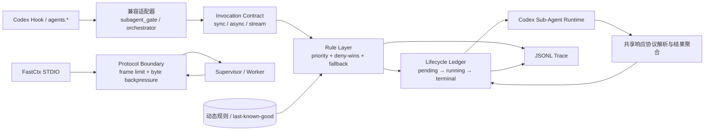

# Codey 内部开发文档

本文档面向 Codey 的开发和维护，保留实现细节、构建发布流程、配置路径、启动恢复机制和已知限制。面向使用者的功能介绍只维护在 `README.md`；不要把协议、端口、路径、构建命令、数据库结构、补丁策略或其他内部技术细节迁回公开 README。

Codey 是一个无界面的 Rust 桌面辅助进程，通过 CDP 连接官方 Codex Electron 客户端，并把 React 配置控制台直接注入 Codex 页面内的隔离浮层。官方线路仍由 Codex 直接连接；OpenAI 兼容的 Chat Completions 第三方线路，以及模型目录中包含第三方模型的原生 Responses 第三方线路，会在 Codex 运行期间启用仅绑定回环地址、使用随机端口的临时协议代理。第三方运行时 provider 配置和代理生命周期均由 Codey 管理；CC Switch 非 Live 线路在首次 Renderer 就绪后会先从磁盘恢复其原 provider 表，其他运行时覆盖仍由租约在退出时原子恢复，代理则跟随受控 Codex 进程关闭。

## 当前能力

- 原生任务 hydration 的 stream owner 发现按 renderer 内的 `clientCoordination` 实例隔离：同一 `hostId + conversationId` 的并发查询复用一份 in-flight Promise，查询完成后立即移除，不缓存成功 owner。后续 hydration 每次重新确认当前仍存活的 owner，避免已断开的旧 owner 让 renderer 误进入 follower 状态、跳过本地历史补载并忽略后续增量消息。空结果、异常和 150 毫秒超时同样不会保留，下一次仍会重新发现；协调器替换、renderer 重载或路由重启会随 WeakMap / 页面生命周期整体失效。
- 启动器的 `CodeyRuntime::start()` 只负责编排七个有序阶段：诊断存储保护、线路快照解析、启动前存储维护、运行时 Provider 配置、补丁与路由监听、进程启动及首屏注入、运行期 watcher 安装；阶段顺序、错误记录、失败恢复和 receiver 返回语义保持不变。macOS / Windows 的 Electron 启动补丁源码独立维护在 `backend/src/codex_startup_patch.js`，Rust 通过 `include_str!` 编译进二进制，前端检查会先执行 Node 语法校验。共享 bridge 统一提供 Statsig 客户端发现、React 内部键枚举以及可配置祖先深度的 fiber 图检索；模型白名单与宠物盾牌不再各自实现 React host 扫描。模型配置 hook 在源头用 `useCallback` 发布业务回调，根 `App` 直接把这些回调传入 memo 子组件，不再为同一组回调逐个建立 ref、layout effect 和外层 callback。
- 打开 Codey 时自动启动 Codex，并通过 CDP 注入 Codey 设置按钮、Fast 模式展示修复、插件市场修复和消息选择工具；设置按钮在 Codex 客户端内部打开 Shadow DOM 隔离的 Semi Modal 配置浮层，不跳转外部浏览器。
- 配置页运行状态卡通过 `runtime_status` 展示 Codey 版本、Codex App 路径、Codex App 版本和维护状态；`codexAppVersion` 优先读取当前受控 runtime 的应用目录，其次读取用户保存的应用路径，不在普通状态轮询里做全系统发现。
- Windows 原生 EXE 使用 GUI 子系统，运行期间不会创建命令行窗口。首次启动 Codex 遇到普通不可恢复错误时，Codey 会恢复临时配置、显示系统错误对话框并退出；CC Switch 路由尚未稳定时则保持后台进程存活，每秒只读复核路由，连续两次得到完整有效快照后自动重试启动，避免外部启动项形成退出与拉起循环。清理失败时，对话框和诊断日志会同时保留启动错误与清理错误。
- 线路同步始终直接读取 Codex `config.toml` 中的活动 provider，并从 provider token 或 `auth.json` API Key 取得凭据，不再根据 CC Switch 数据库选择地址、凭据或活动线路。唯一例外是已同时确认管理态与 Live 标记的 CC Switch 路由：模型列表请求会只读解析数据库中的当前源 API 地址和凭据，构造不持久化的临时请求配置，线路运行配置仍以 Codex 为准。该路径兼容用户手工维护以及 CC Switch 已写入 Codex 的第三方地址、`env_key`、`http_headers` 与 `env_http_headers`；请求扩展只保留在后端临时对象中，不进入 Codey 配置存储或 renderer。provider 范围内的 `experimental_bearer_token` 优先于 `auth.json` 中同时保留的 ChatGPT OAuth，不得把明确的第三方地址误判为官方线路。HTTP 客户端同时加载内置公共根证书与系统原生根证书，使 Windows 已信任的内网 CA 可用于第三方模型同步。CC Switch 路由关闭时，其部分 OpenAI Chat 线路为了满足 Codex 配置约束仍会写成 `wire_api = "responses"`；Codey 只在 Codex 当前直连 `base_url` 与 CC Switch 数据库当前线路的配置地址或 `provider_endpoints` 精确匹配时，读取不含凭据的 `meta.apiFormat` 作为协议提示。`openai_chat` 启用 Codey 协议代理，`openai_responses` 保持原生直连；数据库缺失、旧 schema、解析失败、手工地址不匹配或活动地址为回环代理时均忽略该提示。若活动 provider 以精确的 `name = "OpenAI"` 声明支持 Codex 远程压缩，Codey 会把该能力随线路配置持久化并在临时 provider 中保留。线路变化需要重启由 Codey 启动的 Codex 后生效。
- 官方线路沿用 ChatGPT 登录；原生 Responses 第三方线路继续把 API 地址和临时 bearer token 直接交给 Codex。OpenAI 兼容的 Chat Completions 线路启动时会生成一份不依赖全局状态的显式配置快照，把 Codex 的 Responses 请求经临时回环代理转换为 Chat Completions 请求，并把普通响应、SSE 文本流、工具调用、用量和错误转换回 Codex 所需格式。代理使用系统分配的临时端口并跟随受控 Codex 进程启停；本地 listener 最多同时保留 64 个连接，请求头与请求体分别限制为 64 KiB 和 32 MiB，请求读取使用 15 秒 idle timeout 与 45 秒总 deadline，长时 SSE 响应本身不施加总时限。上游请求复用同一个带连接池的 HTTP client，并单独施加 5 秒连接超时和普通/流式响应头超时；启动或运行时配置失败会立即回收。原生 Anthropic、Gemini 等非 OpenAI 兼容协议仍不在该适配范围内。携带第三方模型的原生 Responses 线路同样经该代理：代理按请求中的 `model` 逐请求选路，命中模型目录第三方模型集合时转换为 Chat Completions，其余官方模型原样直通上游 `/v1/responses`，因此同一会话内主模型与子代理模型可以使用不同协议；模型目录无第三方模型时不启动代理，保持原生直连。
- 官方账号线路默认开启浮动额度展示。额度组件以固定定位浮窗挂在 Codex 右下角，默认保留 24px 边距，套餐、周期额度、余额和本地刷新时间纵向展示；拖拽结束后把浮窗 `left/top` 保存在 Codex renderer 的 localStorage 中，并在窗口尺寸变化时约束回可视范围。轻量 renderer 每 60 秒通过 Codey bridge 请求一次额度快照；Rust 后端只在当前 provider 判定为官方且 `showAccountUsageInHeader` 已开启时读取 `auth.json` 的 ChatGPT access token 和 account ID，请求 ChatGPT backend 的 `/wham/usage`，并兼容 `/api/codex/usage` 旧路径。渲染层只接收已归一化的周期、使用比例、重置时间、方案和余额，不接收 OAuth 凭据；第三方线路、关闭开关或请求失败时会自动隐藏组件或保留上一次成功结果并标记为过期。
- CC Switch 路由接管通过数据库 `proxy_config.enabled`、Codex 的 `proxy_live_backup` 及旧版 `proxy_takeover_codex` 设置识别管理态，并用活动 provider 的 `PROXY_MANAGED` 标记或 `cc-switch-official` 回环地址验证 Live 接管态。Code Switch R 不复用该数据库和标记；Codey 以活动 provider ID `code-switch-r`（兼容旧 ID `code-switch`）加回环地址识别其 Live 路由，因此 `127.0.0.1:18100` 不再被当成普通第三方直连。两类路由都会在 `CurrentProvider.local_route` 中标记，Renderer 将类型和地址标题显示为“本地路由 / 路由入口”。启动时从同一次 `config.toml` / `auth.json` 读取中建立 Live 路由快照，活动 provider 必须存在对应表并带有效 HTTP(S) 地址；第三方线路不得使用 Codex 保留 provider ID。管理态存在但 Live 标记缺失、provider 悬空或地址无效时，Codey 在会话同步和代理启动前停止，提示用户关闭后重新开启路由。有效接管下沿用快照中的 provider、地址、凭据和协议，跳过 Codey 模型目录刷新，并且不再把推理档位、FastCtx、子代理或 Hook 状态写入 `config.toml`：这些 Codey-owned 字段由 Electron 启动补丁作为 app-server 命令级 `-c` 覆盖注入，优先级高于用户层而不污染路由工具管理的文件。可直接编辑的约束源保存在 Codey 配置目录的 `codex-constraints/`：根代理规则为 `root-instructions.md`，FastCtx 规则为 `fastctx-instructions.md`，协作提示为 `collaboration-hint.md`，通用兜底子代理为 `subagent.toml`，另外五类任务的源配置位于 `agents/*.toml`。启动时根据设置页选择覆盖每份源配置的 `model` 与 `model_reasoning_effort`，并生成 `runtime/default-agent.toml` 和 `runtime/agents/*.toml`；源文件可编辑，运行副本不得直接编辑。六类角色分别通过 `agents.<role>.config_file` 引用运行副本，修改约束源或模型选择后需要受控重启 Codex 才会重新合成。旧版未编辑的根规则会按完整默认文本精确迁移，用户自定义内容不会被模糊检索替换。Hook 定义单独合并到稳定路径 `~/.codex/hooks.json`，只追加带 `--codey-subagent-gate-hook` 标记的 group；精确 `hooks.state` 信任哈希作为进程覆盖项注入，退出时按租约恢复或仅移除 Codey group。这样外部路由工具切线可以整份重写 `config.toml` 而不覆盖 Codey 约束。活动地址为已识别的回环路由代理时不会应用数据库中的 Chat 格式提示或启动第二个 Codey 协议代理。路由关闭且直连线路匹配 `openai_chat` 提示时，Codey 才把临时 provider 的 `base_url` 与 `wire_api` 覆盖为自己的 Responses 协议代理，同时保留真实上游地址和凭据用于 Chat Completions 转换；首次 Renderer 与 bridge 就绪后立即按 original/applied/current 三方合并恢复磁盘上的 `model_providers`，租约与代理继续存活，因此 cc-switch 后续切线不会把 Codey 的回环地址保存回旧线路。恢复前会复核活动 provider 与已应用端点，并在原子写前再次做字节 CAS；并发切线时保守跳过，不覆盖外部新配置。Live 接管必须持续保留 watcher，线路语义变化后通过受控重启重建进程覆盖项。
- 配置页以官方账号可见的 7 个模型为固定左列；每次拉起第三方线路前会在 5 秒上限内请求 `/v1/models` 或 `/models`，非路由模式使用 Codex 当前 provider，CC Switch 有效接管时则绕过回环代理、只读解析其当前源 API 地址和真实凭据。源地址必须是非回环 HTTP(S) 地址，`PROXY_MANAGED` 只能作为接管标记，绝不作为 bearer token 发往源服务；解析失败按普通模型同步失败处理。同步成功后仅向 Codex 展示上游支持的模型，无需再手动同步并重启。请求失败、超时或返回空列表时优先沿用该线路上次保存的模型配置，首次使用且尚无保存配置时才回退到固定 7 模型并继续启动。配置页手动同步失败后仍会打开模型弹框，明确提示线路可能不支持模型目录接口；弹框始终列出 7 个官方模型供用户勾选，并允许输入其他模型 ID。其他模型输入会在前后端同时拒绝官方清单中的模型，保存时把官方勾选与其他模型写为该线路的用户声明候选范围，不得描述成 provider 已验证支持。模型声明、上游目录或默认模型保存后，后端会通过当前 renderer 的 CDP 连接把新目录直接传给模型白名单 `setCatalog()`，避免保存请求内部再次调用 bridge 形成重入等待；renderer 同时改写 Statsig 模型配置、触发 `values_updated`、刷新 React Query 的 `models/list` 活跃缓存，并在 app-server 返回旧目录时于消息捕获阶段替换模型描述。模型白名单还会在 `thread/start`、`thread/resume`、`turn/start` 以及宿主的直接和包装 IPC 请求发出前，把缺失或已经不属于当前目录的模型替换为当前默认模型，避免线路切换后继续发送旧 GPT 模型。后端除校验 `snapshot()` 的模型顺序与默认模型外，还要求命中 Statsig 订阅和当前模型查询缓存才把本次保存报告为立即生效；运行时模型基线仅在这些校验成功后更新，因此模型变更可单独清除重启标记，热刷新失败时则保留重启要求。
- 启动前备份 Codex `config.toml`，退出时按 lease marker 原子恢复，`auth.json` 和官方登录状态保持不变。租约同时记录本次 Chat Completions 协议代理地址。应用临时配置时以启动路由快照做 CAS 校验，并在真正拉起 Codex 前再次核对 `config.toml` 与 `auth.json`，防止启动准备期间发生切线。非 Live 的 CC Switch Chat 线路会在首屏注入成功后先恢复磁盘 provider 表，但保留 applied snapshot、marker、FastCtx、模型目录、推理档位和子代理覆盖；停止或异常恢复仍用完整三方合并撤销剩余 Codey-owned 字段。CC Switch 路由模式从租约应用完成后每秒检查一次 Live 配置与认证；watcher 以活动 provider、去尾斜杠后的端点、缺省为 Responses 的 wire API、有效 provider 凭据及认证路由字段组成语义指纹，忽略 TOML 排版、字段顺序、默认字段补写、JSON 排版及 ChatGPT 账号 token 刷新；无法解析时保守回退原始字节比较。语义变化或配置连续两个检查周期缺失后不再把新 provider 指回旧协议代理，而是触发一次受控 Codex 重启；同一语义的新路由即使每次序列化字节不同，也用语义指纹完成稳定性去抖。若新快照仍处于管理态与 Live 文件不一致、文件写入中或启动前再次切线，Codey 不请求自身退出，而是保留 `startupError` 和重启任务、等待连续两个有效快照后再次拉起 Codex；普通启动故障仍沿用原退出策略。停止流程先结束 watcher 和旧 Codex，再关闭旧协议代理并按三方合并恢复最新 CC Switch 基线；新启动重新读取完整路由快照、同步会话并按需建立新协议代理，因此 provider、端点、token 和 wire API 不会跨快照混用。
- 启动器对 `sessions` 与 `archived_sessions` 的 rollout 采用逐行流式检查；只有确实需要改写 provider 的文件才会载入全文，避免长会话历史在启动时形成多份大字符串并把内存峰值长期留在分配器中。
- 启动器只读取 rollout 的首个 `session_meta` 头并流式遍历目录，不再为校验构建全量路径列表；头部校验按目录分片到最多 4 条线程并发执行，任一目录发现 provider 不匹配即整体提前结束。Trace 防护、Crashpad 容量收敛、插件维护和宠物状态会在依赖关系允许时并行执行；诊断存储统计只在用户请求时执行。Provider 迁移、陈旧锁恢复、应用目录解析、模型目录读写、所有 Codey 配置落盘、运行时 TOML 应用以及启动前、失败回滚和停止阶段的配置恢复都通过 blocking worker 执行，避免计划重启、失败清理或保存设置时阻塞仍存活的 async bridge；周期 watcher 写错误日志时使用可等待的 blocking 包装，退出与启动关键路径仍保留同步写入以保证落盘语义。恢复任务仍按原顺序等待完成，不会与进程回收或协议代理关闭并发。启动流程把初始 Renderer 注入、失败清理、watchdog 创建及跨平台进程停止收敛为独立 helper，保持原有失败恢复和 watcher 关闭顺序。配置写锁继续覆盖 CAS 校验、外部副作用、持久化和内存发布，以维持 revision 及磁盘/内存一致性。应用目录解析完成后，启动器先停止并等待旧 Codex 进程退出，再执行 rollout/provider 同步与会话索引清理，避免永久维护和仍在写入的 Codex 竞争；模型目录准备随后在 blocking worker 中执行。官方模型目录在同一次启动内按文件大小和修改时间复用解析结果，不再为 `refresh_for_provider` 和 `selection_state` 各解析一遍。官方 OpenAI 线路只复用该目录计算 Codey 的模型选择状态，不向 Codex 安装 `model_catalog_json`，因此上下文窗口与自动压缩阈值继承 Codex 内置模型元数据；第三方线路仍安装 Codey 目录以支持模型过滤与合成模型。
- Provider 同步器本身会忽略没有可解析 `session_meta` 的临时或残缺 rollout，成功后的头部校验采用相同语义；这类文件不会再让成功标记写入失败并导致以后每次启动重复执行全量同步。真正带有其他 provider 的有效会话头仍会阻止缓存命中。
- Codey 的受控基础脚本会预构建为单个 CDP 文档注入包并在健康恢复时复用，默认注入从 16 次脚本往返降为 2 次；共享 bridge 统一提供 Statsig 客户端发现、React fiber 遍历和带优先级的单点 fetch 拦截注册。插件市场脚本通过共享拦截器接管请求，重复注入只替换同名拦截器，最后一个拦截器撤销后恢复原生 fetch。约 689 KB 的 React 设置浮层、按需组件样式与主题变量只在首次点击 Codey 按钮时注入，用户脚本仍保持独立且最后执行。`public/` 注入脚本在 `vite:build` 阶段压缩到 `dist-overlay/inject/` 后才嵌入二进制；布尔占位符通过数组取值阻断 esbuild 的解析期常量折叠，构建脚本仍逐文件校验占位符幸存并在异常时回退源码，测试同时锁定占位符和压缩收益。浮层 CSS 会剔除所有逗号选择器都带 `-rtl` 类的独立规则，与 `body`/`:host` 共享选择器列表的主题变量块保持原样；本地 Badge 不再静态引入 Semi Tag 及其 Avatar 样式，Card、Modal 的传递依赖在没有产物级视觉白名单前不做选择器盲删。额度组件在数值未变化时跳过 DOM 重建；CDP 注入重试采用约 30 秒总预算内的指数退避，为新版 Windows Codex 较慢的 Renderer 资产准备保留实际注入时间；每 60 秒的额度刷新会记住上次成功的接口端点，失败时仍回退完整列表。
- 配置页的通知、确认框和 Codex 路径弹窗各自使用独立的外部 store；只有对应的 memo host 通过 `useSyncExternalStore` 订阅，提示文本、确认内容和路径输入变化不会重新执行根 `App`。根组件只保留跨面板的配置、运行状态、busy、portal 与诊断快照状态。运行状态响应在写入前按值复用未变化的维护、注入与诊断子快照，完全相同的轮询结果不会提交 React 更新；更新卡、功能策略和运行面板只接收各自需要的稳定切片，诊断、重启和注入复核共用一个有界调度器与单飞状态请求，不会再穿透这些 memo 边界。需要刷新注入证据时由同一次 `runtime_status` 请求完成，Codex App 版本探测按运行目录和配置目录缓存 30 秒。
- 后端核心入口保持为薄门面：Codex 配置中的 FastCtx TOML 与旧租约恢复、命令层的诊断存储与插件市场、启动器的 CC Switch 路由监听与跨平台进程生命周期分别维护在独立子模块中；大型 Rust 单元测试模块也与生产入口文件分开存放，但仍作为对应父模块的子模块访问私有实现。前端设置浮层壳、稳定事件 hook、模型分页策略和各功能域样式同样独立维护；嵌入浮层按固定顺序拼接样式片段，开发预览按同一顺序加载。测试优先直接执行 Rust 逻辑或可独立运行的 TypeScript 策略，源码扫描只保留跨构建边界、注入接线和发布内容等无法低成本行为化的契约门禁。
- `codey-errors.log` 继续只记录失败，并保持逐行 JSON。每条记录只保留北京时间（秒精度）、平台、可取得的 Codey/Codex/Electron/Chrome/Node 版本、事件、操作、错误文本及可选的阶段、可恢复标记和故障所需最小上下文；不再写入毫秒时间戳、PID、耗时、重试次数或超时副本。旧版主进程补丁 helper 记录仍可兼容读取，UTC 或本地时间会统一换算到 `+08:00`，旧 `context` 中的运行时版本会迁入 `versions`。同一事件、操作与错误文本的重复失败按 10 分钟窗口在写入前去重，窗口内只计数、窗口后首条记录的 `context.suppressedRepeats` 携带被抑制条数，缓存按 64 个键 LRU 淘汰，卡死的 Renderer 不会把相同看门狗超时刷屏。Codey 主进程和内嵌 FastCtx sidecar 都在顶层错误与 Rust panic 时同步写入该日志；FastCtx 额外区分 MCP transport 关闭与普通运行失败，并标注 MCP、runtime-bootstrap、runtime-host 或 CLI 阶段。`SIGKILL`、OOM 强杀、断电等无法执行进程内 hook 的终止仍不会产生子进程自记录，需要结合 Codex/MCP 宿主或系统日志判断。协议代理不得持久化 bearer token、API Key、请求正文或用户提示词。CDP 注入仍使用约 30 秒硬 deadline，但详细耗时与重试信息只留在运行态诊断，不进入错误日志。
- 主进程补丁的不可恢复错误继续同步调用日志 helper，保证进程退出前尽量落盘；Renderer 与可选主 bundle 的兼容性失败则在同一事件循环内最多合并 64 条，通过一个异步 helper 批量写入。单个可选 gate 漂移不再各自执行最长 2 秒的同步子进程等待，helper 同时兼容旧单条对象和新数组输入。
- 共享 app state 默认仍位于用户目录下的 `.codex-session-delete`；需要跨进程隔离状态的测试或本地调试可设置 `CODEY_APP_STATE_DIR` 指向完整 state 目录，空值会被忽略并回退默认路径。
- Renderer 启动时只保留设置按钮和三个带侧边栏目标过滤的轻量交互监听；监听在 React 挂载侧边栏前就绪，导入、导出、删除、相对时间和消息选择等会话工具仍要等用户首次悬停、点击或键盘聚焦侧边栏后才加载，加载完成后会撤掉这些监听和启动观察器。增量观察器按新增控件最近的会话行、项目行、侧边栏分区或消息轮次修复，刷新前再次合并祖先/后代根节点，且仅在顶栏确实变化时重找设置按钮；节流在持续变更下最多推迟 250 毫秒，避免流式输出把刷新无限期饿死。侧边栏属性与子节点 mutation 只把受影响的会话行加入同一合并队列，不在每条 observer 记录内同步遍历 React fiber 或递归检查状态栏；Codey 只给官方确认仍在运行的任务外层写入稳定的 running 标记，并通过 flex `order` 在各自列表内建立单一运行中分桶，不移动 React DOM，也不改变多个运行中任务或多个非运行任务之间的官方相对顺序。原生运行状态短暂消失时按会话保留 2 秒 running 标记，并监听 `aria-hidden` 与 `hidden` 变化后复核，避免 React 状态栏切换节点时任务瞬间掉回普通分桶；状态持续缺失才刷新完成时间并释放标记。项目首次展开时，如果 React 完整会话键表明已知运行任务仍属于该项目、但首批 DOM 行尚未包含它，Codey 只触发该项目原生的“展开显示”，新增行仍沿观察器路径标记并置顶；没有隐藏运行任务的项目不展开。置顶、等待介入、未读、最近更新和手动排序仍由官方列表负责。命中带 `data-turn-key` 的消息轮次根节点时直接复用该根，不再枚举整轮后代；消息路径也只跑选择安装器，不执行侧边栏安装器。会话 ID 探测只在用户真正硬删过消息后才进行，消息选择按钮按行缓存而非每次全子树查找。相对时间只遍历已登记且仍连接的会话行并跳过无变化的 DOM 写入；本地任务在首次挂载、任务完成、窗口回前台及页面可见的一分钟节拍通过 Codey bridge 批量读取 Codex 会话索引中的最近活动、更新或创建时间并更新内存缓存，窗口回前台的强制刷新按 10 秒去抖，普通扫描对同一会话按 60 秒限流；远程任务直接复用官方 React 行已持有的 `updated_at` / `created_at`，不误发本地时间请求。观察器额外跟踪项目展开状态与原生“全部显示”状态，不监听流式正文的 `characterData` 或无业务消费者的 `style` 变更；`class` 仍用于识别原生会话运行态与 spinner，不得移除。插件 bridge 使用有界指数退避等待宿主接口，也不会再序列化无关 IPC 的完整参数，并在解析请求体前先做子串预筛，避免为无关请求整体 `JSON.parse`。
- 宠物屏蔽脚本不会跨扫描缓存 React fiber 判定：React 可能复用 host element 并独立替换 props/fiber；性能由 bridge 的单个 document-root `MutationObserver`、合并后的 `attributeFilter`、有界根队列和帧调度控制。宠物与完全访问权限提示共用该观察器，最后一个订阅撤销时才断开；宠物脚本还复用 bridge 提供的控件描述归一化、控件子树查询、事件拦截与 teardown 骨架。renderer 启动观察器会在会话工具接管后断开，正式会话工具观察器仍按生命周期接棒，不并入盾牌分发器。完全访问权限提示只扫描新插入的子树并改用 `textContent`，不再每次触发整页按钮遍历和布局刷新。模型白名单的交互重扫按 2 秒节流，未找到 QueryClient 时的完整 React 图发现最多每 10 秒执行一次；目录加载和已加载目录的短时安全重投递都按 120 毫秒起步指数退避，后者上限 1 秒且不会并发执行两次投递，前者上限 2 秒且同一时刻只保留一个刷新计时器；相同目录的后台重推和窗口聚焦重载都会跳过全量失效投递。原生任务 hydration 仍先尝试发现其他窗口的现有 stream owner，但本地协调超过 150 毫秒即继续 `thread/read`/`thread/resume`，不再等待上游固定 5 秒超时。
- 后台会话状态轮询对每个变更的 rollout 采用可续解析：JSONL 只追加时按已消费字节偏移续读并只解析新增行，因此活跃会话不再每 3 秒重读整份历史；首次读取、重写后的全量回退和增量尾部都通过复用行缓冲区流式消费，不再把整份 rollout 读成一个大字符串。缓存只保留一份可续解析 state；文件变化时直接接管旧 state 的所有权，最终聚合时才生成调用方需要的拥有型结果。无 rollout 变化且没有待确认调用时，缓存与 watcher 通过同一个只读 `Arc` 复用上一轮聚合快照；存在待确认时只重建持续时间会变化的 pending 列表，started/aborted/completed 事件、session 状态与 turn 配置继续按各自 `Arc` 复用，不再每轮深复制 5 个 `Vec` 和 1 个 `HashMap`。每个 rollout 只保留最近 256 个终态 turn 及最多 512 份 turn 配置，终态到达时同步清除该 turn 的待确认调用；通知 tracker 的终态去重集合上限与 64 个最近会话的缓存总容量一致，避免长会话轮询导致 Codey 常驻内存与每轮复制成本持续增长。已消费前缀的头尾各 64 字节使用固定内联缓冲区保存并在续读前校验，校验读取不再临时分配 `Vec`；Codey 自身重写 rollout（删除对话轮、归一 provider）或文件被截断时自动回退为全量解析。只读 SQLite 连接会在数据库文件未变化时跨轮询复用，避免稳定空闲期反复打开同一状态库。会话标题缓存的同步锁与 SQLite 工作整体位于 blocking worker 内，async future 不再持锁跨 `await`，同一个 cache 仍按顺序独占复用。活跃任务保持 3 秒检测，稳定空闲时按 3/6/12/30 秒退避，窗口恢复或用户交互会立即唤醒。
- 上游模型目录请求在请求级设置 12 秒总时限，并在读取 chunk 时强制执行 8 MiB 响应上限；解析结果最多接受 10000 个唯一模型，每个模型 ID 最多 512 个 UTF-8 字节。启动同步外层的 5 秒预算继续覆盖源配置解析和整个请求；配置页的交互同步不再使用短于双端点回退路径的前端伪超时，同一进程内由专用同步锁串行，避免超时后后台迟到写入与重试竞态。配置页目录合并使用线性 Set 去重，模型弹窗关闭时不构造内容，打开后支持搜索并按 200 项分批挂载，避免大目录一次创建全部 React 节点。
- 旧版配置可能把固定官方模型写进 `selectedModelsByProvider` 或 `manualThirdPartyModelsByProvider`。`CodeyConfig::normalize` 会按内置官方 slug 大小写不敏感地识别这些条目，规范后迁移到 `declaredOfficialModelsByProvider`，并从两个第三方字段移除；已有官方声明优先保留，真正的第三方模型与 `upstreamModelsByProvider` 不参与迁移。这样用户显式选择过的官方模型在后续 `/v1/models` 同步为空或遗漏条目时仍属于持久声明，但不会被误标为 provider 已验证。
- 运行期 CDP bridge 将 websocket 读取、handler 执行和响应写回解耦：只读状态、模型目录、账号额度和插件列表最多并发执行 8 项，其他 API、懒加载以及会话导入导出仍进入单一串行通道；待处理队列上限为 256。协议代理入口只解析一次 Responses 请求 JSON，Chat SSE 转换器接管已拥有的请求对象；诊断日志通过 4096 项有界后台队列写入，按 64 条或 100 毫秒批量刷新，队列满时快速失败并在后续日志中记录丢弃数。rollout 头缓存的版本、provider 和条目未变化时不再仅因校验时间变化而重写文件。
- Codex Trace 写盘防护通过 SQLite `block_log_inserts` trigger 阻止 `logs_*.sqlite` 持续写入高频诊断日志；设置开关，已有日志和会话数据不会被删除。
- macOS Crashpad 磁盘保护与 Trace 共用诊断存储界面，但保持独立策略和开关。它只检查 `Application Support/Codex/Crashpad/pending` 与旧版 `Application Support/com.openai.codex/web/Crashpad/pending` 两个 allowlist 目录，不递归搜索其他产品数据；只把 UUID 命名的 `.dmp` 与 `_sidecar.json` 识别为同一报告组，跳过符号链接、未知文件、子目录及 Crashpad 的 `new`、`completed`、`attachments` 和设置文件。保护默认开启：启动时执行一次，此后每 5 分钟检查；总占用超过 512 MiB 时按最旧完整报告组回收到 384 MiB，至少保留最近 10 分钟写入。自动收敛不删除孤儿文件；手动清理可额外删除静默超过 24 小时的已识别孤儿。删除前后复核文件长度、修改时间及 Unix inode/device，消失或发生变化按并发竞争跳过。扫描、部分删除或后台任务失败只进入本地错误日志和诊断快照，不阻断 Codex 启动。
- Windows 默认开启新版卡顿补丁：Codey 在 Codex 主进程执行前通过仅绑定 `127.0.0.1` 的临时 Inspector，把会反复触发原生 DLL 加载失败的 `@worklouder/device-kit-oai` 替换为无设备桩，并断路每 30 秒启动一次的进程快照 Worker。已知 `child-process-snapshot-worker` 文件名或 `name: "child-process-snapshot"` Worker 语义名称会直接识别；文件改名、哈希化、改用 file/data URL 或 eval 且没有语义名称时，则读取有界 Worker 源码，并只在同时命中 PowerShell / pwsh、`Get-CimInstance` / `Get-WmiObject`、`Win32_Process`、`Win32_PerfFormattedData_PerfProc_Process` / RawData 变体及 Worker 通信特征时断路；源码判定缓存以文件 device、inode、长度、mtime 与 ctime 身份为键并采用最多 256 项的 LRU 淘汰，同一路径文件被替换后不会复用旧结论。命中后直接返回合法空快照，不再启动 PowerShell；普通 Worker 和用户主动执行的 PowerShell 不受影响。替换 `worker_threads.Worker` 后还会同步 Node 的 ESM 内建导出，避免新版 Codex 通过 `import { Worker } from "node:worker_threads"` 绕过拦截。主进程保留 Worker 包装状态、ESM 同步状态、观察时长、源码检查与实际阻断计数，并通过现有 IPC 状态桥交给 Renderer 有界复核；界面只有在实际阻断过目标采样时才把该保护标记为已确认。观察窗口内没有匹配到目标 Worker 时仍保持待确认，并明确提示当前 WMI 来源可能尚未被识别。Inspector 随后立即关闭，不修改 Microsoft Store 安装目录。
- Windows 受控启动额外通过 Chromium feature 参数关闭后台进程 EcoQoS。Chromium 在 Windows 11 会把后台 Renderer 调度到节能核心；Codex 首屏的 `app://` 资源改写和 CDP bridge 恰好运行在该 Renderer 内，窗口尚未前台化时可能因此出现数秒无响应。该参数只应用于 Windows 进程树，不改变 macOS/Linux，也不等同于关闭 GPU。
- Windows packaged-app 启动不再把 `ActivateApplication` 成功等同于“调试参数已落到新进程”：激活前后的 PID 快照若表明 Store 复用了旧单实例，则按启动快照的创建时间复核进程身份后清理并只重试一次，再次复用时立即返回明确错误，不进入 CDP 盲等；安全终止不再把未经创建时间复核的 PID 交给 `taskkill`，避免 PID 复用误杀。Renderer target 选择兼容标题尚未就绪的 `app://-/index.html` 主页面，仍要求 page WebSocket 并排除 Avatar Overlay；注入 deadline 命中时会保留当前阶段和脱敏后的最近失败分类，页面标题、WebSocket 地址、URL 查询参数及脚本异常正文不进入该错误，便于区分页面枚举、target 选择、bridge 安装、浮层验证与状态读取。
- Renderer 模型与 Fast 控件补丁同时支持旧式 gate 和新版 React Compiler 生成的赋值形态。新版模型过滤器若已经通过 `isCustomModelProvider` 原生绕过官方 allowlist，会按语义识别为兼容而不再记录假失败；service-tier 控件、Fast 快捷键和模型触发器仍要求各自唯一命中，避免宽泛改写。协议层除保留已知 chunk 语义名外，还会从 `index.html` 的脚本入口发现最多 128 个哈希化资源路径，未被入口引用的未知资源保持原样且不会克隆；改写响应会清除长度、压缩与实体校验头，避免缓存复用旧实体元数据。兼容门禁使用合成回归 fixture，并在维护时可对本机实际 `app-initial` 资源执行只读验证。
- macOS / Windows 启动补丁会从 Codex app-server 的本次进程参数中移除 `--analytics-default-enabled`，追加进程级 `analytics.enabled=false` 覆盖，并在主 bundle 中显式关闭桌面主进程与 worker 的 CES 批量遥测，不改写用户配置。补丁同时移除 Codex 每 30 秒向当前 Renderer 拉取完整 app-state、仅写入调试日志与 Sentry breadcrumb 的诊断 heartbeat，并把每次 `browser-window-focus` 触发的外部插件状态检查合并为 30 秒 leading + trailing 节流，减少频繁切换窗口时对 Chrome profile、插件 marketplace 和本地清单的重复扫描；Renderer 就绪或显式触发的诊断快照仍保留，窗口内发生的插件变化仍会在尾部补做一次检查。每轮任务结束且全部已观察 turn 都进入终态后，执行回收继续清理可安全重建的 `node_repl` helper，并通过 Codex bundle 自带的 `child-process-snapshot-worker` 重新建立 app-server 子进程归属；新版主 bundle 已移除旧的 `listProcessManagerSnapshot` / `child-process-kill` 接口，因此补丁不再依赖该内部 process manager。MCP 回收只处理同一 app-server 下完整命令完全相同、已经并存超过 30 秒的重复根进程：首次快照后等待静默屏障，再用第二份快照按 PID、父 PID、命令和启动时间复核，保留最新根进程，并从最深子进程开始向上发送 `SIGTERM`。唯一 MCP、最新实例、普通 app-server 子进程和活跃任务都不会被终止，也不会为了回收而反复执行 MCP 能力发现；快照和终止计数通过启动补丁状态保留供诊断。
- Windows Git 请求保护会在 Codex 主进程启动前原位包装 Electron 的 `ipcMain.handle` / `handleOnce` / `on` / `once` 注册方法，并按消息内容识别 Git worker 请求和 Codey 状态探针，不再依赖 Codex 的具体 IPC channel 名；`electron` 与 `electron/main` 两种主进程入口都覆盖。这样 Codex 调整 channel 名或注册方式后，后续 handler 仍会被保护。同一包装层提供 Git 与 WMI 的只读状态握手；针对新版 preload 只等待 `ipcRenderer.invoke`、不再向页面返回结果的行为，主进程还会通过 Renderer 消息通道回传带请求 ID 的状态事件，页面只有收到匹配回执后才确认保护，不能把空返回值当作成功。旧客户端或主进程补丁降级时，Renderer 脚本仍尝试包装 `electronBridge.sendWorkerMessageFromView("git", ...)` 作为兼容回退；若 bridge 晚于注入出现，会使用有界退避重试。直接请求只识别 `git-origins`、`status-summary`、`review-summary` 与 `branch-diff-stats`；`subscribe-live-query` 按订阅语义限流，不再依赖内部只读查询名，也不要求消息重复携带 `workerId`。写操作、未知直接方法、其他 worker 和非 Windows 平台完全透传。首批请求使用容量为 3 的令牌桶通过，持续速率补充为每秒 1 个，同一仓库与查询键至少间隔 2 秒；等待队列总量封顶 48、单键封顶 6，最长等待 15 秒。尚未发送的请求收到原生 cancel 时会从队列移除。Renderer 回退还能对传输或可观察的 worker 响应失败执行最高 15 秒退避；两层都不伪造 Git 结果，也不缓存或合并不同 request ID，避免让 Codex worker 的 pending 请求失去对应响应。
- macOS / Windows 默认开启兼容型宠物精简：Codey 先把 Codex 自带的 `electron-avatar-overlay-open` 启动状态设为关闭，使宠物默认保持收起；Codex 设置页的 Pets 入口会在激活前按宠物专属语义 ID 屏蔽，设置 chunk 对 `codex-avatar` 的静态依赖替换成无资源桩，避免设置页预先载入宠物预览和内置精灵图，个人菜单和命令菜单中的宠物控件也继续屏蔽。主 bundle 中 Avatar Overlay manager 的启动预热会变成 no-op，普通启动不再提前创建长期隐藏的 `BrowserWindow`；同时匹配透明、无边框、不可聚焦、置顶和任务栏隐藏语义的 Overlay 会在隐藏时强制恢复后台节流，重新显示时再恢复上游显式关闭节流的设置。manager、`initialRoute=/avatar-overlay`、专用 preload 与原生 `avatar-overlay.node` 仍保留，用户主动使用官方语音时可通过原生 presentation 路径按需创建。不得按窗口尺寸、`Pet Surface` 标题或 Avatar Overlay 通用 ID 全局拦截普通窗口。关闭开关后会在下一次由 Codey 启动 Codex 时恢复宠物、控件及原生预热，不改写 `app.asar`。
- 可选的 FastCtx 上下文优化默认关闭。没有现有 FastCtx 配置时，打开后会在下次启动 Codex 时把内嵌版本作为本地 STDIO MCP 临时注册，提供带分页和输出预算的 `inspect_local_file`、`grep`、`glob` 与 `replace` 工具，减少文件读取、搜索和机械替换产生的命令拼装与冗余上下文；无需另外安装 FastCtx、npm 包或 Node.js。检测到用户已经配置 FastCtx 时，设置页会禁用内置开关并通过悬浮提示说明原因，保存接口与启动配置层也会强制保持内置版本关闭，不复用用户 server、不注入 Codey FastCtx 指引。
- 可选的提示词优化默认关闭，独立于当前线路运行。用户可配置 OpenAI 兼容 API 地址、模型、凭据和自定义优化指令；配置热更新后 Codex composer 旁的按钮即时显示或隐藏。API Key 只保存在后端配置，渲染层只接收是否已配置的脱敏状态；优化日志不记录提示词正文或凭据。
- 可选的 Codey 子代理角色与调度增强默认关闭；它叠加在新版 Codex 默认启用的原生子代理能力之上，不再被描述为子代理总开关。打开后，Codey 通过公开 `[agents]` schema 写入 `enabled`、最大并发数、默认模型和默认推理档位，并暂时保留 `features.multi_agent_v2` 下的工具命名空间、等待参数与 Hook 兼容开关；usage hint、根规则和 FastCtx 指引不再落入用户配置，而是从独立约束文件合成进 app-server 命令级 `-c` 覆盖。用户已有的 `agents.interrupt_message` 原样保留，旧 `max_threads` 在新并发键缺失时迁移，`max_depth` 清理。随后注册 `codey_quick_scan`、`codey_deep_research`、`codey_visual_analysis`、`codey_worker`、`codey_visual_worker`、`default` 六个任务角色。`CodeyConfig.subagent_roles` 独立保存每个角色的模型与推理档位；旧配置缺少该字段时，把原有单一选择迁移到全部六类，部分角色缺失时从 `default` 补齐，未知角色丢弃。设置页只在开关开启时展示任务矩阵；每行复用当前线路模型目录并按模型元数据限制推理档位。普通模式仅对 `config.toml` 的结构性字段使用租约，六类角色通过 `config_file` 引用 Codey-owned 运行文件；不再把 Codey 规则正文写入 `config.toml`、`AGENTS.md` 或 `agents/default.toml`。CC Switch Live 模式则继续只通过启动覆盖项注册相同文件，不写用户层 `config.toml`。生成 `model-catalogs/codey-official.json` 时保留本机官方缓存的 `multi_agent_version`：该字段只描述模型作为协调器的能力；合成第三方模型会移除模板继承的标记。Codex 0.147.0 起允许未标记为 V2 的 leaf model 作为子代理，因此角色候选继续包含当前线路全部可用模型，无需伪造协调器能力。线路切换或目录刷新时逐角色优先保留仍可用的选择，否则使用线路默认模型、Terra 或首个可用模型，并逐角色修正不支持的推理档位；目录暂时不可读或线路没有已选择模型时保留用户配置且不自动关闭增强。运行时始终注册稳定的六个角色文件路径；已启用状态下保存角色模型或档位时，在生命周期锁和运行代次复核内一次性重建六个文件，逐一验证 TOML，并在任一失败时恢复全部文件和租约。Codex 每次派生角色都会重新读取对应 `config_file`，所以下一次派生直接使用新配置，不重启 Renderer、app-server 或 Codex；首次启用或关闭、线路与 FastCtx 边界改变仍保留重启标记。正常退出或下次异常恢复时还原启动前结构性配置，运行期间发生的独立用户修改会保守保留。
- 合成的第三方模型目录固定声明 `low`、`medium`、`high`、`xhigh` 四档推理强度，默认使用 `low`，不得继承本机官方模型缓存中的推理档位。Renderer 热刷新目录时也必须携带同一份第三方模型元数据，避免已打开页面继续沿用旧缓存中的单档能力。
- Windows 原生 EXE 启动会移除继承到子进程的陈旧 `WSL_DISTRO_NAME`，避免新版客户端无意同步探测 `wsl.exe`；用户在 Codex 中明确启用的 WSL 模式不受影响。
- 配置页提供“清理诊断存储”按钮：同一操作会在线清空 Trace 日志、截断 WAL 并压缩数据库，同时清理已稳定写入的 Crashpad 完整报告组；不会直接删除运行中仍被 Codex 持有的 SQLite 文件，也不触碰会话、账号、配置、插件或 Crashpad allowlist 之外的数据。Trace 与 Crashpad 分别返回清理结果，部分失败不会隐藏另一侧已经完成的回收。
- 诊断存储使用两个独立统计模块和一个组合刷新命令。Trace 快照展示日志条数、SQLite 实际占用和内容字节估算；Crashpad 快照展示目录、完整报告、文件、占用、时间范围和是否超过上限。两个 blocking 扫描并发执行并分别原子替换内存快照；配置页状态查询只序列化现有快照，不触发磁盘扫描。
- 侧边栏相对时间通过 Codey bridge 在 blocking worker 中只读复用 `SessionMetadataCache` 的 SQLite 连接，不再让 Renderer 寻找官方 signal dispatcher 或分页调用 `thread/list` / `thread/read`。每轮最多批量查询 200 个当前可见的本地任务，按 `recency_at_ms`、`recency_at`、`updated_at_ms`、`updated_at`、`created_at_ms`、`created_at` 的兼容优先级读取时间；超过 200 条的待处理项由独立 pump 接续。普通请求按会话限流 60 秒；批量读取失败时保留已有标签、不立即重试，等待下一刷新周期，避免不可用接口形成紧密重试。删除墓碑、无效时间与数据库中已缺失的时间会阻止旧缓存复活。删除、重载等功能只解析入口脚本声明的具名会话资产，不遍历或读取全部 Renderer 资源。
- 会话与插件修复在每次启动 Codex 前自动执行；普通模式的目标 provider 只读取得 Codex `config.toml` 当前活动值，根键缺失时按 Codex 规则使用内置 `openai`；CC Switch Live 模式只接受同一份已验证路由快照中的 provider。会话修复不会创建、重命名或切换 provider，也不会把悬空或高风险的保留 ID 写入历史。所有可解析 rollout JSONL 的 `session_meta.payload.model_provider` 与全部 Codex SQLite 中的 `threads.model_provider` 会永久对齐到该目标，并补齐 `has_user_event`；Provider 同步不得修改 `threads.cwd`、全局工作区根或按路径保存的偏好，避免 Windows 扩展路径、斜杠和盘符大小写变化导致历史被重新归入其他项目。没有可解析 `session_meta` 的残留或部分 rollout 同时被同步器与启动复核忽略，并按文件签名缓存，不会迫使每次启动重复全量同步。运行中切换 Live 线路会自动安全重启并重新对齐全部历史。Codey 不在退出时回滚这些会话改动，修复后直接启动原版 Codex 仍能看到历史会话。
- 启动官方 Codex 前会清理 `session_index.jsonl` 中既不存在于 rollout、也没有任何 SQLite 引用的精确格式幽灵任务。索引缺失或没有可清理条目时直接跳过，不再为此遍历全部 rollout 并对每个 Codex 数据库做全表扫描。首次解析会记录精确候选行身份，真正过滤时直接复用该计划，不再为同一 JSONL 做第二轮反序列化；重复 ID、未知结构、损坏行、CRLF 与无末尾换行保持原有语义。写入前保存原始索引并做快照一致性校验，备份位于 `~/.codex/backups_state/provider-sync`，保留最近 5 份 Codey 索引清理备份。
- 会话索引清理只有在至少成功发现一个 rollout，或一个包含会话引用 schema 的 SQLite 数据库后，才会把“未找到候选 ID”视为权威结果。来源目录暂时缺失或为空时原样保留索引且不写跳过 marker，后续启动仍会重新验证，避免 Windows packaged-app 启动窗口把“来源尚未发现”误判成“全部会话都是孤儿”。
- CDP watchdog 区分 Renderer 忙或命令超时与 WebSocket 传输/Upgrade 失败：前者保持 inconclusive 且不叠加注入任务；后者视为已保存 page target 失效，立即重新枚举 `/json` 并替换 bridge target。失败诊断会记录是否要求 target rediscovery，便于区分过期 URL 与页面繁忙。
- 新版 Codex 的消息选择按 `data-turn-key` 选择整轮对话；Renderer 与后端会把 `history-content:turn:<turn_id>` 等 DOM 键归一成 rollout 使用的原始 `turn_id`，后端同时识别 `task_started` 与 `turn_context` 轮次边界并原地重写 rollout JSONL。页面末尾若仍使用 `history-content:tail:<index>:*` 临时键，后端只接受从 `tail:0` 开始无跳号的连续后缀，并要求对应 rollout 轮次都已写入 `task_complete` / `turn_aborted` 终态，再按从新到旧的顺序解析为稳定 `turn_id`；每个临时键会在写墓碑前保存到稳定 ID 的别名，同一次卸载后的二次清理和重复点击都会复用原 ID，不会把已经移动的尾部轮次当成新目标。跳号、非末尾选择或无法稳定解析时拒绝猜测，旧临时键也不会在后续启动时漂移到新的末轮。删除意图会先以不含正文的稳定轮次墓碑落盘，下一次启动在旧 Codex 已停止且新进程尚未恢复会话时重施，防止活跃内存延迟写回让已删上下文复活；未匹配到持久化轮次时页面不再先隐藏 DOM 制造删除成功的假象。Renderer 会从当前入口脚本解析具名会话资源，不依赖构建 hash：旧版继续使用唯一的原生 signal dispatcher；新版从 `app-initial` 的唯一语义导出解析 `AppServerManager`，再从 React scope 取得 local manager。消息删除依次执行原生缓存丢弃、卸载后的墓碑重施、会话恢复和最近列表刷新；完整会话删除复用同一控制器执行缓存丢弃和删除通知。旧版 SQLite 消息表继续兼容。
- 每条侧边栏会话提供数据导出按钮，生成带 `Codey会话-` 文件名前缀的可移植 `.codey-session.json`；导出时直接流式转义 JSONL 内容，不再为每行分配第二份转义字符串，并在序列化过程中强制执行 512 MB 传输上限，临时文件不会先膨胀到上限之外。会话列表标题栏兼容 Codex 的 `Tasks` 与 `Recents` 两代分区名称并提供全局导入入口，本地项目目录也提供导入按钮，可恢复完整 rollout 并将会话挂到目标项目。重复 ID 会自动导入为副本，不覆盖已有会话。
- 配置面板提供“恢复备份”，默认恢复最近一次会话数据库备份，也可通过 `restore_session_backup` 命令传入备份目录。
- 官方 curated 和本地工具插件市场通过 CodeyRuntime core 的兼容逻辑注册；`openai-curated-remote` 仅作为外部流程产生的可选本地缓存，缺失时不判为故障，存在时必须注册到其精确缓存路径。页面层合并可用的本地插件并清理隐藏/远程路径字段。
- 配置面板可保存用户脚本；脚本作为独立 CDP 文档脚本在内置修复脚本之后执行。

## 运行时性能约束

- 后台会话扫描每轮仍枚举 `CODEX_HOME/sqlite` 以发现新增和删除，但会按数据库、WAL 元数据及 Unix 文件身份缓存 schema 探测结果；未变化候选不再重复打开 SQLite 查询 `sqlite_master`。已确认的会话库继续复用只读连接，近期会话查询使用连接级 prepared statement cache；数据库或 WAL 变化、同路径替换和 legacy `state_5.sqlite` 仍保持原有发现语义。
- CDP watchdog、重新注入和注入状态复核的周期错误日志通过 Tokio blocking pool 写入，避免文件锁、尾行修复和 flush 占用仅有的 async worker；启动、退出和恢复关键路径仍保留同步日志语义。健康探针在页面内做真实 bridge 往返并区分三态：bridge 缺失才计入重注入门槛，页面忙（CDP 可响应但页内往返超过 2 秒预算）与 CDP 超时一律按 Inconclusive 处理，绝不向已卡住的 Renderer 追加脚本注入。
- 通知配置最多保存 32 个渠道，单个事件最多并发投递 4 个渠道；结果仍按渠道汇总，去重与不确定投递语义不变。
- 官方额度快照在后端成功缓存 30 秒；专用 mutex 合并同一时刻的 bridge 请求。失败后按 60、120、240、300 秒退避并封顶 300 秒，退避期间不重复读取 `auth.json` 或请求远端；成功后立即清除失败状态。

## 构建

需要 Rust 与 Node.js。首次构建前在本目录安装 `package.json` 中的前端依赖：

```bash
npm install
npm run check
cargo test --manifest-path Cargo.toml
npm run build
```

Windows 上执行 `npm run dev` 时，脚本只检查本次 Cargo profile 对应的本地 `codey.exe`。发现旧进程会先停止启动并要求从系统托盘或原终端正常退出，以便 Codey 清理 Codex 子进程和临时配置；只有确认进程卡死时才设置 `CODEY_DEV_FORCE_KILL=1` 重试。强制终止后会重新确认该进程已退出，确认失败时不会启动 Cargo。`npm run dev` 会先完整 `cargo build` 再 `cargo run`，确保 `codey-fastctx` sidecar 与主程序位于同一目录；直接手动 `cargo run` 前需要先 `cargo build`，否则本次启动会按未启用 FastCtx 继续并记录错误日志。

macOS 构建会同时生成无 Tauri 的 `target/release/bundle/macos/Codey.app`；直接打开该 App 即可启动 Codey。构建脚本会用最新 release 二进制重建并进行本地 ad-hoc 签名，避免继续运行旧包内的程序。

GitHub Actions 工作流 `.github/workflows/build-desktop.yml` 支持手动触发及推送 `v*` 标签触发。手动运行后可在 Actions 下载 macOS arm64/x64 未签名 ZIP 和 Windows x64 NSIS 安装程序；标签构建还会把这些文件附加到对应 GitHub Release。

### Cloudflare R2 更新分发

更新二进制可以发布到公开的 Cloudflare R2 bucket。标签发布时，工作流会先创建 GitHub Release，再将三个安装包上传至 `releases/<tag>/`，并分别写入版本化的 `releases/<tag>/latest.json` 和固定的 `latest.json`。清单包含版本、平台、包类型、下载链接、文件大小和 SHA-256；客户端默认使用项目公开的 R2 更新源，本地构建无需额外环境变量，发布构建仍可覆盖更新源。

先创建 R2 bucket，并为它绑定公开的 R2.dev 或自定义 HTTPS 域名；随后在 GitHub 源码仓库设置中配置：

- Actions variable `CLOUDFLARE_R2_BUCKET`：R2 bucket 名称。
- Actions variable `CLOUDFLARE_R2_PUBLIC_BASE_URL`：不带末尾 `/` 的公开 HTTPS 域名。构建时会写入 `${base}/latest.json` 作为更新地址。
- Actions secret `CLOUDFLARE_ACCOUNT_ID`：Cloudflare account ID。
- Actions secret `CLOUDFLARE_API_TOKEN`：仅授予目标 bucket `Workers R2 Storage: Edit` 权限的 API Token。

标签版本必须与 `package.json` 的 `version` 完全一致。本地发版脚本会同步 `package.json`、`Cargo.toml` 和 `Cargo.lock`，随后运行检查、提交、创建 tag 并推送到 GitHub：

```bash
pnpm run release -- 0.2.1
```

脚本默认要求工作区干净，避免把未确认改动一起发出去。需要把当前所有未提交改动放进这次发布提交时，显式使用：

```bash
pnpm run release -- 0.2.1 --include-existing-changes
```

可选参数：`--skip-checks` 跳过本地检查，`--no-push` 只创建本地提交和 tag，`--remote <name>` 指定推送远端。

未配置上述 variable 或 secret 时，现有 GitHub Release 发布不受影响，R2 同步会被跳过。默认构建使用项目公开的 R2 更新源；设置 `CODEY_UPDATE_BASE_URL` 可以在编译时覆盖该地址。配置页面不允许用户改写更新源。检查更新会经 HTTPS 拉取清单，校验版本、下载地址和 SHA-256 格式后显示是否有新版本；同一清单 URL 的检查结果缓存 30 秒，下载命令可复用 10 分钟内已验证的候选，网络或解析失败不写缓存，因而页面先检查再下载不会重复拉取清单。Codey 在恢复旧租约后、启动 Codex 前执行一次更新 preflight：检查超过 300 毫秒才显示无按钮的原生状态窗，10 秒硬超时、网络错误或清单错误均关闭提示并继续启动。Windows 状态窗运行在独立 Win32 消息线程；macOS 主线程运行 AppKit 事件循环，Tokio runtime 移到工作线程，状态窗使用不激活 Dock 图标的 `NSPanel`。发现当前平台可安装的新版本时使用原生自定义按钮询问；选择稍后会把本次结果保存在 `AppState`，renderer 从 `/backend/status` 恢复 Codey 图标红点，本次运行不再强弹，后续每 30 分钟只静默刷新红点。确认更新后复用同一次检查已验证的资产信息，显示下载校验状态，最长等待 300 秒；安装器成功拉起后直接退出 preflight，不进入 Codex 启动循环。下载、校验或安装器启动失败时提示错误并继续启动 Codex。当前 macOS 包仍是未签名包，Windows 包也尚未进行代码签名，因此不会静默下载或安装。

Codey 将运行时 core/data crate 固定在 `vendor/CodeyRuntime`，生命周期、会话扫描优化以及显式配置的独立协议代理句柄也已直接合并其中。主程序只复用该句柄和既有 Responses↔Chat 转换器，不接管 vendor 的整套启动器或全局设置。后端启动编排与 macOS/Windows/Unix 进程适配分层维护，运行时 TOML 三方恢复算法和私有原子文件 I/O 基元也已与 provider 应用/租约编排分离。本地与 CI 构建不需要额外的运行时源码目录或补丁。这些 crate 与后端同属根 Cargo workspace，`cargo test --workspace` 一条命令覆盖全部；统一依赖解析与特性合并消除了两个独立 workspace 的重复编译。PR 质量门在 Linux 上执行格式检查、完整测试及零警告 Clippy，Windows CI 补充该平台测试与 Clippy；桌面发布构建只保留 macOS 的 Rust 测试（macOS 无独立 CI 任务），Windows 的 Rust 检查由 CI 门保证，打包流程不再重复编译。

运行时只内置不含提示词的 Codex 模型兼容元数据，完整 system/developer prompt 不进入仓库资产或 CodeyRuntime 二进制。Codex 自定义模型目录的每个条目需要保留 `base_instructions`；本机官方 `models_cache.json` 可能直接提供该字段，也可能只在 `model_messages.instructions_template` 中提供等价模板。Codey 只从用户本机缓存派生运行目录，在本机写出前按默认 personality 解析模板并补齐旧版兼容字段，同时把生成文件权限收紧为仅当前用户可读写。缺少任一可用指令来源的本机缓存时不生成不完整目录，官方线路回退 Codex 内置目录，第三方线路仍可完成上游模型探测、手动模型选择保存与子代理能力校验；这是可恢复的内置目录回退，不记录为补丁失败。模型选择保存与线路模型同步必须只吞掉该明确的缓存兼容错误，目录读写或解析错误仍应返回给用户。这类本机派生内容不得写入日志、测试夹具、发布包或版本库。

## 配置与路径

- Codey 配置：由 `directories` 根据系统保存到 Codey 配置目录下的 `config.json`。
- 通知渠道在渠道弹窗确认后立即通过统一配置保存事务落盘并同步通知 watcher，不依赖控制台顶部的二次保存；安装更新前还会提交当前未保存设置，避免更新重启丢失仅存在于渲染器内的草稿。
- cc-switch 配置：数据库用于判断 CC Switch 路由接管状态、匹配直连线路的协议提示，以及在有效路由接管下为模型目录请求只读解析当前源 API；不会替代 Codex 配置成为活动线路来源，也不会持久化源凭据。`CC_SWITCH_DB_PATH` 指定的数据库文件优先级最高；否则读取 cc-switch Tauri Store 中的 `app_config_dir_override` 并跟随其自定义数据目录，未配置覆盖时使用 `~/.cc-switch/cc-switch.db`。Windows 还与 cc-switch 一致：仅在默认数据库不存在时兼容旧版 `HOME/.cc-switch/cc-switch.db`。
- Codex 配置：显式、非空白的 `CODEX_HOME` 始终优先（即使目录尚未创建），避免首次解析时静默回退并把另一套会话目录缓存到当前 Codey 进程；未配置或仅空白时才使用默认目录（通常是 `~/.codex`）。
- Trace 写盘防护由 `disableTraceLogWrites` 控制，默认开启；macOS / Windows 使用相同启动时机更新 Codex 根目录及旧版 `sqlite/` 目录中现有的 `logs_*.sqlite`，不会创建、清空或压缩日志库。macOS Crashpad 容量保护由独立的 `protectCrashpadPending` 控制，默认开启且保存后热切换；Windows 保留兼容配置字段但不扫描 Crashpad 目录。
- Windows 卡顿补丁不设开关：Codey 在运行时识别 Windows，并在每次启动 Codex 时自动隔离 Micro 设备模块和周期性 WMI 进程采样。启动成功只表示主进程补丁已安装；WMI 保护通过独立运行时证据区分等待首次采样、已实际阻断和观察窗口内未匹配到可识别目标，只有实际阻断才确认生效，不能再用安装结果直接宣称 WMI 已修复。启动 Codey 时若目标 Codex 主进程已在运行，会先终止该安装目录下的 Codex 进程树，确认退出后再拉起新主进程，确保补丁能在主进程执行前安装；清理失败会中止启动。macOS 不执行 Windows 专属分支。
- 宠物精简：`slimCodexPet` 默认为 `true`，在下次通过 Codey 启动 Codex 时生效。启用后默认收起宠物、隐藏宠物专属入口、精简设置页预览资源，跳过 Avatar Overlay 的启动预热，并在 Overlay 隐藏时恢复后台节流；共用 manager 和语音能力仍保留，只有主动使用语音时才按需创建 Overlay。关闭后下次启动会恢复完整宠物功能和原生预热。
- 浮动额度：`showAccountUsageInHeader` 默认为 `true`，保存后立即生效且不要求重启。只有活动线路被识别为官方账号登录时才请求并展示，切到第三方线路后保留开关值但停止请求和显示；用户手动关闭后的持久化值不会被默认值覆盖。
- FastCtx 上下文工具：`fastContextTools` 默认为 `false`。设置页与运行时使用同一套独立 token 规则检查 `mcp_servers`，普通 table、子项 inline table 和根 inline table 都会检查；只要非 Codey-owned server 的 ID、`command` 或 `args` 命中 `fastctx`（大小写不敏感），就返回 `fastContextToolsStatus.userConfigured = true` 和对应 `serverId`。读取、UTF-8 或 TOML 解析失败时改为返回 `detectionFailed = true`，仅把 FastCtx 开关锁定为关闭并显示悬浮原因，不阻断其他设置的加载和保存。通用保存接口会再次检测并强制把 `fast_context_tools` 归一化为 `false`，启动配置层也保留同一防御；用户 server 完整保留，Codey 不注册内置 server、不注入 FastCtx 指引，也不把外部 namespace 写入子代理配置。带 `--codey-fastctx-mcp` 标记的 Codey-owned server 无论使用普通或 inline TOML 都能在关闭时删除；重新启用时会规范为普通 table，同时保留已有的非托管字段和环境变量。
- 未检测到外部 FastCtx 时，Codey 才在本次运行的临时 `config.toml` 中注册随 Codey 分发的 `codey-fastctx` sidecar 作为独立本地 STDIO MCP。FastCtx、o200k 分词器和 portable tool-schema 归一化只编入该 sidecar；sidecar 保留 `--codey-fastctx-mcp` 作为 Codey 自有注册标记，并把上游 `runtime-bootstrap` / `runtime-host` 子进程交给 CLI 分发。内置版本固定到 FastCtx 0.2.5 的 `e9b80dd8`，避免 `$ref`、nullable union 等 provider 不兼容 schema 让整组工具在请求阶段失效。
- 内置 FastCtx 默认采用上游 Standard 输出边界：用户未配置 Codex 工具输出上限时临时设置 60000 token，FastCtx 总预算为宿主上限的 90% 且最多 54000；grep 和 glob 再分别封顶为 10800 与 5400，避免提高多文件读取吞吐时同步放大搜索结果。用户已有更小的正数宿主上限时保留原值并同步收缩 FastCtx 总预算；用户显式配置 `tool_output_token_limit = 0` 时保留 0、不再派生 FastCtx 预算，并移除 Codey 此前写入的 `FASTCTX_*_TOKEN_BUDGET` 环境变量（用户自建 env 键保留）。MCP 启动和单工具超时分别为 120 秒与 300 秒；namespace 保留在 `features.code_mode.direct_only_tool_namespaces` 中，避免 code-mode 聚合截断 FastCtx 的 `Complete/Partial` 尾部。FastCtx 自身的 `search.max_cpu_cores` 和 replace 文件上限继续由其用户配置管理，Codey 不改写共享的 `~/.fastctx/config.toml`；shell 工具保持关闭。
- FastCtx 0.2.5 自带的 provider output guard 默认开启：检测到缺少远程压缩能力的第三方线路时，会在连接上下文内把宿主/FastCtx 防线收紧到 10000/9000，并覆盖普通预算环境变量；该保护优先于 Codey 的 Standard 上限，切回支持远程压缩的线路后恢复所选输出档位。Codey 不关闭或伪造 provider 检测。
- FastCtx 只发布 `inspect_local_file`、`grep`、`glob`、`replace` 四个直接工具。共享指引要求批量读取 2–32 个已知文本范围、先用 `files_with_matches` 缩小搜索范围、使用稳定 project glob，以及对 replace 执行 dry-run、替换数保护和写后复核；分页严格串行跟随工具返回的 continuation。CodeGraph 仍只处理符号和调用路径等语义理解。路由 Hook 只强制改道普通 `rg`、`rg --files`、无格式选项的 `cat` / `Get-Content`；`ls`、`wc`、`tail -f`、`find`、带高级 regex、ignore、编码、计数或输出格式语义的 `rg` 直接放行，避免不等价重定向。Resources 参数保护和 `# codey-fastctx-fallback` 显式回退继续保留。
- 历史 Codey 提示词采用一次性持久迁移：创建运行时租约和原始快照前，Codey 会从磁盘基线中的根 `developer_instructions`、`features.multi_agent_v2.subagent_developer_instructions`、`AGENTS.md` 和 `agents/default.toml` 删除可确认归属的旧版固定规则，其中包括 0.2.4 及更早 FastCtx 模板、曾随 0.2.5 写入但缺少 Resources 边界说明的模板，以及全部已知子代理根规则版本；动态外部 namespace 的旧 Codey FastCtx 模板也会迁移，普通与 inline 配置使用同一清理规则。精确等于 Codey 旧默认模板的 `agents/default.toml` 会移除，带用户自定义内容的文件只清理已识别的 FastCtx 段落。写入前重新核对原始字节，避免覆盖同时发生的用户修改。当前根规则、FastCtx 指引与协作提示分别保存在 `codex-constraints/root-instructions.md`、`fastctx-instructions.md` 和 `collaboration-hint.md`；内容仍精确等于任一历史默认版本时直接升级为当前默认，任何自定义内容原样保留。启动时从这些独立文件构造命令级覆盖，磁盘 `config.toml` 只保留用户提示词和结构性设置，因此退出恢复不会让旧规则复活。关闭或被外部 FastCtx 阻断时仍会幂等清理 Codey-owned server、完整提示词块和残留的 `mcp__codey_fastctx` namespace——该 namespace 名称本身即可确认归属，只要保留 ID 未被用户 server 占用即一并清掉，不要求同次调用恰好移除了其他构件；用户其他提示词、server、自有 namespace 和输出上限保持不变。
- 提示词优化：`promptOptimization.enabled` 默认为 `false`，打开后即时生效且不要求重启。配置使用脱敏保存的 `baseUrl`、`apiKey`、`protocol`、`model` 和可编辑 `instruction`；界面直接展示内置默认指令，空持久化值仍由后端回落到同一默认值。第三方线路可调用独立命令一次性读取活动 profile、Codex 本地配置与 CC Switch 当前源，复制真实 URL、Key、协议和默认模型并立即持久化；官方登录线路不展示同步按钮，后端也会拒绝同步。同步返回 renderer 前仍清空 Key，只保留 `apiKeyConfigured`；依赖额外请求头但没有标准 API Key 的线路要求手动配置独立接口。测试和模型列表命令可使用未保存草稿并回填被脱敏的 Key，请求按保存的 Chat Completions 或 Responses 协议发送，Responses 结果兼容 `output_text` 与标准 `output[].content[].text`。`optimize_prompt` 只从 renderer 接收待优化文本；输入最多 32K 字符，优化结果最多 8192 字符。响应与错误预览使用流式有界读取，非成功 HTTP 状态按失败返回，404 自动补 `/v1` 重试后以重试响应作为最终诊断。前端同步、测试和模型列表操作互斥，前端兜底超时长于后端请求时限；composer 观察器在输入控件尚未找到、已经断开、导航事件或与 composer 相关的 DOM 变化时重新扫描，无关页面 mutation 不触发全局查询与布局检查。
- Codey 子代理角色与调度增强：`subagentOptimization` 默认为 `false`。关闭时设置页只显示开关与说明；开启后显示“快速定位、深度检索、视觉分析、代码实施、视觉实施”五类用户可配置的专用任务，每类都有用途提示、独立模型和推理档位。`default` 仍作为只读的内部兼容角色注册并保留旧配置，但不再展示给用户，也不允许根提示主动选择。候选由受支持的 `officialModels` 与全部 `thirdPartyModels` 组成；新版 Codex 将其中不具备协调器标记的模型作为 leaf model 使用，因此不再设置静态 V2 白名单。线路切换、启动和手动刷新模型目录时逐角色校验，已保存模型仍可用时保留，否则依次尝试线路默认模型、Terra 和首个可用模型，推理档位仅在目标模型不支持时回退。旧版单一 `subagentModel` / `subagentReasoningEffort` 配置首次加载时会无损扩展到六个运行角色，`default` 角色继续同步这两个兼容字段。已启用运行时保存角色配置或模型选择导致角色回退时，会逐个原子替换六个运行文件，再校验整组并更新 applied snapshot；任一步失败都按租约快照恢复旧文件和旧状态。成功后清除这部分 `restartRequired`，失败则保留旧运行文件并返回热更新错误。首次启用、关闭或其他运行边界变化仍要求重启。角色 TOML 中的 `sandbox_mode` 只定义默认权限；Codex 会重新应用父任务当前的实时 sandbox / approval 覆盖，因此界面和文档不得把角色名描述为独立安全边界。
- 子代理约束文件与路由：可编辑规则正文全部位于 `codex-constraints/`，根代理规则、FastCtx 指引和协作提示分别使用 `root-instructions.md`、`fastctx-instructions.md` 与 `collaboration-hint.md`，子代理源文件使用 `subagent.toml` 和 `agents/<role>.toml`。Codey 只对内容仍精确等于历史内置模板的独立文件执行一次性迁移；用户修改过的指令不会再靠全文检索替换。开启增强时还会通过 `features.multi_agent_v2.multi_agent_mode_hint_text` 注入主动委派模式，覆盖 Codex 默认的“仅显式请求才派生”限制，使根代理重新按任务收益决定是否使用子代理；关闭增强或退出租约后恢复用户基线。根约束采用 direct-first 但更积极使用只读探索：回答、单一事实、已知位置且不超过两个小文件/三次本地工具调用、即将修改的确切代码、奠基性文档和顺序依赖任务直接处理；至少两次独立定位、两个并行分支且每支约两次调用并合计约五次、跨至少两个目录或四个候选文件的归纳，以及大量外围材料都应考虑只读委派。独立写入实现仍以约六次调用和互斥 ownership 为较高参考门槛。上述数量只用于提示层软路由，不再写入运行时契约，也不会把任务规模变成“小任务禁止派生”的硬条件。没有清晰收益时仍由主代理直接处理。新配置和无效并发配置的中央并发默认值为 3；同时带有 Codey 角色注册与 `tool_namespace = "agents"` 的旧运行配置若仍为历史默认值 2，会自动迁移到 3。独立的用户显式 `max_concurrent_threads_per_session` 以及其他合法旧 `max_threads` 原样保留。根提示允许已确认的纯只读批次最多并发三个；只要包含写入型或身份未确认代理，并发上限仍为两个。任务胶囊不复制父对话，结果以 `completed/partial/blocked` 状态、最多五条关键证据和 gaps 返回；确定性测试优先于额外 verifier，证据冲突不按多数票裁决。每次启动会把子代理源文件、当前 FastCtx 指引和设置页选择的模型/档位合成为 Codey-owned `codex-constraints/runtime/` 副本，用户只编辑源文件，不直接编辑运行时副本；角色设置热更新复用同一合成和校验流程，并保持注册路径不变；热更新是否注入 FastCtx 指引按租约记录的 `fastctx_command` 判定（本次运行已注册内置 server 才注入），与启动路径按实际注册判定的语义一致，而不是读取当前配置开关。普通模式在临时 `config.toml` 中仅注册六个 `[agents.<role>]` 的 description 与 `config_file` 路径，根规则、FastCtx 指引、协作提示和主动委派模式通过进程级 `-c` 覆盖注入；CC Switch Live 隔离模式连这些角色注册也全部使用进程级覆盖，并在目录可用时用绝对路径覆盖 `model_catalog_json`。两种模式都不把 Codey 规则正文写入用户 `config.toml`、`AGENTS.md` 或 `agents/default.toml`。该目录保留官方协调器标记并让第三方合成模型保持未标记 leaf 状态，所以切换线路不会覆盖 Codey 约束、污染 CC Switch 配置或夸大模型能力。根代理路由提示按任务选择 `agent_type`，模型与推理档位由对应角色 TOML 固定。
- 子代理等待门禁与 Hook：Codey 显式开启 `features.multi_agent_v2.wait_agent_enabled`，等待上限为 120 秒。根代理先完成同批派发，再用 `agents.wait_agent`/`agents.list_agents` 汇合；每个已派生代理终态前，根代理只允许 `agents.*` 协作，本地读取、网络、命令、写入和根任务结束全部阻断；child 仅可用 `agents.send_message` 定向 `/root` 回报，不能查看、等待、中断或追派其他代理。终态为 `FINAL_ANSWER`、`task_complete`、`completed`、`errored`、`error`、`failed`、`shutdown`、`not_found`；`running`、`pending_init` 以及尚未收到可信根中断成功回执的 `interrupted` 仍是活动状态。Codey 注册 `PreToolUse`、`PostToolUse`、`SubagentStart`、`SubagentStop`、`Stop`、`SessionEnd` 六类同步 Hook；`PostToolUse` 暂用 `*` matcher，但进程内只对派生、状态对账、批次决策和精确验收命令访问账本。Hook 输入兼容常见 ID/type 别名，完整无筛选 `list_agents` 负责最终对账。状态以 ledger 为主、marker 仅为旧版回退；10 分钟停滞或 60 分钟绝对 Stop 上限到达时，先在 ledger 中原子把活动 attempt 转为 `recovered/lost` 并 fence，再清理 marker，避免下一次 Stop 重新复活。绝对上限仍保留协议诊断和未清偿写验收债。Hook 状态损坏时根和子代理的数据工具全部 fail-closed；root 只保留状态对账，child 只保留向 `/root` 定向回报。输入超过 1 MiB 或 JSON 无法解析时同时返回兼容 deny/block。运行代次、session 和 fencing 隔离迟到事件；旧 `[agents]` 并发迁移与模型覆盖限制保持不变。
- 子代理 Hook 来源兼容：`HookInput` 同时读取官方 `agent_id` / `agent_type`、`turn_id`、`transcript_path` / `agent_transcript_path` 的 snake_case、camelCase 及现有别名。带 child ID 或类型的调用按子代理处理；活动批次中缺少 child 身份时，只允许与首个根派生调用完全相同的 `turn_id` 继续批内编排，其他匿名调用仅可等待或执行无筛选 `list_agents` 对账。`PostToolUse` 只把顶层或已知 provider envelope 中与本次 spawn 输入精确相等的 `/root/<task_id>` 记为 provisional task 关联；Codex 生命周期/工具 Hook 暴露的不透明 child UUID 还必须通过 child transcript 首行 `session_meta` 完成第二阶段绑定。该桥接要求 transcript 是 `~/.codex/sessions` 下的非 symlink JSONL、文件名后缀与 UUID 一致，且 metadata 中的 `id`、父 session、精确 `/root/<task_id>`、角色以及 direct/nested 重复字段全部一致；`SubagentStart` 未及时完成时，child 首次 `PreToolUse` 使用相同规则补绑。任意任务输出、父路径分量、唯一 pending、权限面相同候选或冲突别名都不能触发绑定；格式漂移或缺少可信关联时，child 的读取、命令、网络和写入全部 fail-closed。
- 子代理异常接管策略：局部 `MESSAGE`、部分结果和未知状态不视为完成；明确终态失败会保留可核验证据并由主代理接管，不自动重派。重复任务 ID 返回稳定的 `CODEY_SUBAGENT_DUPLICATE_TASK_ID`，并按 reservation 的 `pending`、`running`、`failed`、终态/恢复态给出恢复动作；没有明确失败且缺少可绑定代理 ID 的 PostTool 响应继续保留为 `pending`，等待生命周期事件或完整快照确认，不再伪装为 `running`。根代理收到该错误后先执行一次完整 `list_agents` 对账：命中原代理时等待或消费结果，明确无匹配时由主代理接管；仅当任务范围实质改变且仍值得委派时，才使用新的 `task_name` 最多重试一次并同步更新 V2 契约 ID，禁止重复旧 ID、立即 Stop 或改走本地命令路由。`pending_init` 长时间无进展或代理累计运行 10 分钟无终态时，根约束要求先执行一次完整 `list_agents` 对账，再对对应代理执行一次 `interrupt_agent`；成功回执立即 fence 并核销该 attempt，由主代理直接接管，不再等待或追派，失败或无法唯一匹配时才继续对账并依赖有界恢复。只有缩小或改变后的任务仍独立达到选择性委派阈值时才允许最多重派一次。用户新输入会使当前批次过时，根代理先对账并中断仍活动的代理；成功后立即接管，迟到结果不得驱动新请求。运行时门禁继续负责 fail-closed（含子代理写工具）、代次隔离、10 分钟遗留状态兜底和 60 分钟 Stop 绝对上限；提示词层的接管规则不宣称能够替代 Codex 调度器的强制取消。
- `followup_task` 生命周期门禁：该工具只允许根代理命中当前会话账本中 `running`、已绑定 `agent_id_hash`、未 fence 且派生成功的 reservation；child 的 `wait/list/interrupt/followup` 全部拒绝，只允许 `agents.send_message` 定向 `/root`。`pending`、终态、恢复态、账本缺失或 target 无法匹配时，`PreToolUse` 在真正唤醒子线程前返回 `CODEY_SUBAGENT_FOLLOWUP_REQUIRES_ACTIVE_ATTEMPT`。pending 分支只允许根代理先做一次完整 `list_agents` 对账；其他分支禁止重试旧 canonical task。读取、命令或写入无法安全绑定时统一返回 `CODEY_SUBAGENT_UNBOUND_ATTEMPT`。
- Codex App 路径：留空时使用 CodeyRuntime 的平台发现逻辑。Windows 自动发现失败或已保存路径失效时，会在启动阶段打开原生目录选择器并持久化规范化后的应用目录，因此自定义盘符不依赖尚未启动的 Codex 页面；配置页只展示当前解析结果，不提供无法在首次启动失败时触达的恢复弹窗。目录解析兼容安装根目录下的 `app`、`bin`、`current` 与 `versions/current` 布局。
- CDP 默认端口：`9229`，如 Windows 端口被占用会按 core 的逻辑选择可用回环端口。

- FastCtx 路由 Hook 会对每个命中的 `PreToolUse` 独立执行；拒绝原因只保留目标函数与显式回退标记，完整的工具发现、code mode 和 Windows 路径规则由运行时 FastCtx 指引统一提供，避免连续读取时在 Codex 钩子面板重复刷出整段说明。

### Codex `config.toml` 统一配置模型（2026-08）

本节是 `config.toml` 配置管理的维护契约。Codey 自身的 `config.json`、`auth.json`、运行时 lease、模型目录 JSON 和 Hook 文件不属于这个 schema；它们仍使用各自的存储事务。活动 Codex `config.toml` 的生产读写必须经过 `codey_runtime_core::config_manager::ConfigManager`，备份目录中的历史快照不属于活动配置入口。

#### 强类型 schema 与覆盖优先级

`ConfigManager` 同时保留两种表示：`DocumentMut` 保存未知字段、注释、顺序及 Codex 将来新增的字段；`CodexConfigSchema` 是经过类型和语义校验的只读视图。当前管理字段如下：

```toml
# 全局公共片段；字段可省略。
base_url = "https://api.example/v1"
model_provider = "provider-a"
model_catalog_json = "custom-models.json"

# 每个 provider/route 是独立分片。切换模式不得删除非活动分片。
[model_providers.provider-a]
base_url = "https://provider-a.example/v1"
wire_api = "responses"

[model_providers.route-b]
base_url = "https://route-b.example/v1"
wire_api = "responses"

# Codey 的模式选择器与 provider 数据分离。
[codey.routing]
enabled = false
active_route = "route-b"

[codey.non_routing]
active_provider = "provider-a"
```

对应 Rust 类型为 `CodexConfigSchema`、`RoutingConfig`、`NonRoutingConfig`、`RouteConfig`、`ResolvedConfig` 和带 `FieldSource` 的 `ResolvedField<T>`。`routing.enabled` 使用 `Option<bool>` 保存“文件未配置”和“文件明确配置 false”的区别；最终有效值才回落为 `false`。`ConfigSnapshot` 以 `Arc` 发布原始字节、TOML 文档、强类型 schema、解析后有效值及 SHA-256 revision，调用方只能读取不可变快照。

有效配置覆盖顺序固定为：调用方传入的 CLI `ConfigLayer` > Codey 专用环境变量 > 文件 > 内置默认值。环境变量为 `CODEY_CONFIG_BASE_URL`、`CODEY_CONFIG_ROUTING_ENABLED`、`CODEY_CONFIG_ACTIVE_ROUTE` 和 `CODEY_CONFIG_ACTIVE_PROVIDER`。不读取通用 SDK 的 `OPENAI_BASE_URL` 作为隐式覆盖，避免 provider SDK 环境污染 Codex 路由。CLI/环境覆盖只影响有效快照，不反向写回文件。

`set_routing_enabled` 只修改 `[codey.routing].enabled` 并立即发布新的有效快照；`active_route`、`non_routing.active_provider`、全部 `model_providers`、全局字段和未知字段均保留。活动路由与非路由 provider 分别通过 `set_active_route` 和 `set_non_routing_provider` 更新。Provider 的 `base_url` 只能通过 `ConfigManager::set_provider_base_url` / `ConfigEditor::set_provider_base_url`，根 `base_url` 只能通过对应 root setter；增量 `edit_document` 检测到任何绕过 setter 的 URL 变化会拒绝保存。兼容旧的整文档合成流程时只能调用 `replace_text` / `replace_document`，该入口仍在 `ConfigEditor::set_complete_document` 中集中记录所有 URL 差异，并要求非空 `reason` 与 `caller` 后写结构化审计。

#### 统一数据流

```text
CLI overrides ─┐
environment ───┼──────────────┐
config.toml ───┘              │
                              v
reader -> ConfigManager.load/reload -> shared process lock + config.toml.lock
                                      -> immutable bytes + TOML parse
                                      -> CodexConfigSchema.validate
                                      -> precedence resolution
                                      -> Arc<ConfigSnapshot>

writer -> update / typed setter / replace_text
       -> acquire the same two locks
       -> reload current bytes + compare expected revision
       -> mutate DocumentMut and account for every base_url delta
       -> parse + full schema validation
       -> rotate config.toml.bak[.N]
       -> write a unique same-directory temporary file + fsync
       -> atomic replace/rename config.toml + fsync parent directory
       -> publish new immutable snapshot + structured audit event

external route watcher -> ConfigManager.read_raw (read-only malformed-write observation)
restore -> restore_latest_backup / lease three-way merge -> same validated writer transaction
```

默认保留 5 个历史版本：最新旧值是 `config.toml.bak`，更早版本依次为 `config.toml.bak.1` 至 `.bak.4`。保存前先验证候选；当前文件存在时才旋转并写备份；目标替换失败时旧 `config.toml` 不变，临时文件会清理，`.bak` 仍保存写入前内容。Unix 下目录/文件权限分别收紧为 `0700`/`0600`；Windows 使用带 replace-existing 和 write-through 的原生原子替换。`ConfigFileSystem`、`FileLockGuard`、路径、备份数量和 `ConfigAuditSink` 都可注入测试实现。

#### 生产路径清单

| 责任 | 统一入口及文件 | 行为 |
| --- | --- | --- |
| Provider 应用、临时 overlay、租约三方恢复 | `backend/src/codex_config.rs` | 通过 revision CAS 调用 manager 的整文档写入/删除；lease 备份继续承担跨进程恢复证据。 |
| CC Switch/Code Switch R 活动线路读取 | `backend/src/cc_switch.rs` | 从同一个强类型不可变快照读取 provider、URL、wire API 和请求扩展。 |
| 路由切线 watcher | `backend/src/launcher/route_overlay.rs` | 文件 metadata 只用于快速跳过；内容统一通过只读 `read_raw` 获取， malformed 外部写仍可触发保守变化检测。 |
| 后端插件列表 | `backend/src/plugin_marketplace.rs` | 从 manager 快照读取已启用插件。 |
| Relay 配置、Goals feature 与完整配置切换 | `vendor/CodeyRuntime/crates/codey-runtime-core/src/relay_config.rs` | 候选与 auth 先校验；配置提交使用 manager，auth 失败恢复保持原事务语义。非法现有 TOML 不再用文本 fallback 重建。 |
| 插件市场注册 | `vendor/CodeyRuntime/crates/codey-runtime-core/src/plugin_marketplace.rs` | 在快照上合并 marketplace/plugin 字段并以 revision 提交。 |
| Windows Computer Use guard | `vendor/CodeyRuntime/crates/codey-runtime-core/src/computer_use_guard.rs` | 在快照上修复 plugin/marketplace 项并以 revision 提交。 |
| 模型目录与本地资产读取 | `vendor/CodeyRuntime/crates/codey-runtime-core/src/model_catalog.rs`、`assets.rs` | 只读 manager 快照，不再单独读取和解析活动文件。 |

#### 原问题根因、证据和复现

1. `model_catalog_json` 被当成 Codey 独占字段。旧 `backend/src/codex_config.rs::patch_config_with_fastctx_mode_and_proxy` 在官方/无 Codey 目录分支无条件 `remove`，第三方分支无条件覆盖，因此 `model_catalog_json = "/Users/a1-6/.codex/custom-models.json"` 会在 Codey 启动合成时消失。复现是写入任意用户目录后调用 official patch；回归测试 `official_patch_uses_the_official_endpoint_and_preserves_a_user_catalog` 与 `direct_patch_preserves_a_user_model_catalog_when_codey_catalog_is_requested` 锁定修复。现在只新增/替换 Codey 自己的 `model-catalogs/codey-official.json` 引用，任意其他用户路径原样保留。
2. CC Switch provider 表被整表替换。旧 provider 合成只有 `cc_switch_provider_id.is_none()` 时才克隆现有表，带 CC Switch ID 时会丢失 `http_headers`、重试参数、`env_key` 和未知字段。`cc_switch_provider_patch_preserves_unowned_provider_fields` 使用带 headers/retry 的现有 provider 复现；现在所有非保留 provider 都以原表为基线，只覆盖 Codey 明确管理的 name、endpoint、wire API、认证标记和本次 token。
3. 多个全文件写者没有共享锁或 revision。插件市场、Computer Use guard、Relay 切换和后端 runtime writer 曾分别执行“读取整文件 -> 合并 -> 各自原子 rename”；两个原子写都成功仍会由后提交者覆盖先提交者。`config_manager::tests::stale_revisions_cannot_overwrite_a_newer_write` 使用同一 revision 并发两个线程，断言只有一个提交成功，失败者必须 reload。
4. 非法 TOML fallback 会扩大损失。旧 Goals feature 文本 fallback 在 TOML 解析失败时跳过整个 `[features]` 区段，再拼回单个 `goals` 字段；重复表等局部错误可能因此删除其他 feature。`set_codex_goals_feature_rejects_invalid_existing_toml_without_overwrite` 现在断言报错且字节不变；修复非法文件必须由用户或明确迁移器处理，普通 setter 不猜测重建。
5. 路由与非路由读取各自解析。CC Switch、模型目录、插件列表和 watcher 曾用不同的缺省值、错误降级和读取时刻，造成 UI 看到的 provider 与启动器应用的 provider 不一致。迁移后除 watcher 的显式 raw observer 外，生产读取都从 `ConfigSnapshot` 获得同一 schema 和 revision。
6. `base_url` 的临时代理覆盖缺少统一审计。Chat Completions 需要把 Codex endpoint 临时指向本地 Responses 代理，这是有意的运行时变化；问题在于旧写入入口无法区分有意 setter 与整文档副作用。现在所有提交记录 operation、reason、caller、revision、模式和 `base_url_changed`，并继续用 original/applied/current 三方恢复避免覆盖外部切线。

#### 测试、迁移和回滚

核心单元测试覆盖缺失文件默认值、CLI/环境/文件优先级、显式 false 来源、模式往返保留 provider/公共字段/注释、setter 门禁与审计、最近 N 份备份、并发 revision 冲突、非法候选及注入的原子替换失败。Relay、CC Switch、Provider lease、插件市场和 route watcher 的既有集成测试继续覆盖跨模块行为。

升级不在 load 时重写文件；只有第一次真实变更才创建 `.bak` 并提交新内容。已有合法 TOML 的未知字段和注释随 `DocumentMut` 保留；已有非法 TOML 会返回解析错误且不覆盖，维护者应先从错误位置或备份修复。部署前可先复制现有 `config.toml`，升级后检查结构化 `config_manager` 诊断事件及 `.bak`。需要回滚时优先停止 Codey/Codex，调用 `restore_latest_backup` 或把 `config.toml.bak` 复制回 `config.toml`；仍有运行时 lease 时先执行既有 lease restore，再恢复 `.bak`，避免把临时 overlay 当成用户基线。旧版本会忽略 `[codey.routing]` / `[codey.non_routing]`，因此二进制回滚不要求删除分片；若必须完全回退 schema，可恢复升级前备份。

本次核心文件清单：`vendor/CodeyRuntime/crates/codey-runtime-core/src/config_manager.rs`、该 crate 的 `lib.rs`/`Cargo.toml`、`relay_config.rs`、`plugin_marketplace.rs`、`computer_use_guard.rs`、`model_catalog.rs`、`assets.rs`，以及后端 `codex_config.rs`、`cc_switch.rs`、`launcher/route_overlay.rs`、`plugin_marketplace.rs` 和对应测试。技术设计只维护在本文件；公开 README 不记录路径、锁、备份算法或内部模块名。

### 子代理批次决策控制面

开启增强时注册 direct-only 的 `mcp__codey_subagent_control__resolve_batch` 本地 STDIO MCP，并在普通临时配置和 CC Switch Live 隔离覆盖中同步写入 command、args、启动/工具超时与 namespace。该 Codey-owned server 强制 `enabled_tools = ["resolve_batch"]`、清空残留 `disabled_tools`，并只对 `tools.resolve_batch.approval_mode = "approve"` 设置工具级放行；不设置 server-wide `default_tools_approval_mode`，因此 `approval_policy = "never"` 下也能执行内部决策，但不会扩大其他 MCP 工具的权限。上述 allow/deny 列表与嵌套 approval scalar 都进入进程级运行时覆盖，避免 CC Switch Live 隔离路径漏配。工具只做严格 schema 校验并回显 `spawn_next_batch`、`continue_root`、`complete` 或 `blocked`；真正授权由 Hook 两阶段提交：`PreToolUse` 在会话账本准备决策，`PostToolUse` 只在响应包含完全匹配的 `accepted` 回执后提交。每个 decision ID 在根回合内唯一且有界，reason 只持久化哈希。

批次终态后普通根工具和 Stop 都会要求显式决策：`continue_root` 放行直接工作但不能结束，`spawn_next_batch` 只授权一次真实 `agents.spawn_agent`，`complete`/`blocked` 允许机械验收和 Stop。提交在账本删除或下一批授权被消费前可用新的 ID 显式改写，工具失败不会误放行，也不会盲目自动派发。账本 schema v8 记录控制面连续失败次数与首个失败时间，并移除旧预算与累计计数字段；无匹配回执或 Stop 无进展累计 3 次，或自首个失败起超过 10 分钟时，状态转为独立的 `ControlPlaneFailed` 终局。该状态不会伪造 `blocked` 决策，也不授权普通根工具或新批次，只允许机械验收与最终 Stop/账本清理，并返回稳定错误码 `CODEY_SUBAGENT_CONTROL_PLANE_FAILED`；这样控制工具未注册、启动失败或持续返回错误时仍 fail-closed，但不会形成无限 Hook 循环。有效 accepted 回执、运行代次切换和下一批启动都会清零计数。全批都在创建阶段失败时仍不自动换批，避免容量故障形成重试风暴。

### 子代理编排内核

- 根代理在可信 turn 中成功调用 `agents.interrupt_agent`，表示永久放弃该 target，而不是暂时暂停后等待恢复。PostToolUse 只接受结构化、无错误且带可识别状态的回执，并按唯一 target 原子把 reservation 转为 `Recovered/Lost`、设置 fence、清理对应 legacy active marker；后续 `followup_task` 在唤醒前拒绝，迟到 `SubagentStop` 保持幂等。失败、自由文本或无法唯一匹配的 interrupt 回执不释放任何 attempt。wait/list 的 10 分钟停滞窗口只在 agent/status 的语义指纹变化时重置；重复 `interrupted` 或 timeout 快照不再无限延长回收时间，60 分钟绝对兜底仍保留。
- 根代理调用 `agents.spawn_agent` 时，明文 `message` 的最后一个非空行必须携带 `CODEY_DELEGATION_V2=<compact-json>`。`fork_turns` 缺省时按 `none` 处理，任何非 `none` 值仍拒绝，避免隐式复制不必要上下文。V2 契约记录任务 ID、1–128 字符审计原因、角色视觉能力、工作区根目录、读写 ownership、最多 8 条机械检查（单条最多 1024 字符、合计最多 4096 字符），并可携带 `sync`/`async`/`stream` 调用模式、`trace_id`、`parent_id`、能力列表、deadline 及输入/输出 JSON schema；每份 schema 序列化后最多 4096 字节、嵌套最多 16 层，并随 reservation 持久化，trace 只记录其哈希。任务 ID 必须与 `task_name` 一致。V2 严格拒绝 `calls/files/dirs/large/risk/budget_class/branch_calls` 等已退出的字段；升级期间仍兼容读取 V1，并在解析后丢弃这些旧规模与预算字段。新版 Codex 可能在 `PreToolUse` 前把整个 `message` 替换为不透明的 Fernet 风格密文；门禁不尝试解密，只允许它形成 `native_read_scope` 只读 reservation，写入角色仍必须改用可验证明文/签名 sidecar 契约或交回主代理。`native_read_scope` 只用于冲突调度：由于密文读取范围对 Hook 不可见，这类 reservation 与任何活动写 ownership 双向互斥；它不参与运行时文件路径授权。普通明文缺少契约仍会被拒绝，只有满足密文形状检查的单段 URL-safe token 才进入兼容路径。活动 child 以非终态 `MESSAGE` 报告任务正文解密失败时，等待门禁会明确要求根代理通过 `agents.send_message` 只重述一次自包含目标、输入、范围、约束和验收上下文，再继续等待；不得中断后重派。重述无法送达、再次失败或 child 已终态时由根代理接管，禁止循环重试。任务规模只在派发前的软路由判断中使用，不作为“小任务禁止派生”的硬条件。
- 子代理调度不按成本点、每批尝试数、批次数或根回合累计尝试数设置硬性预算上限，相关账本字段、角色成本配置和自适应预算计算已删除。当前批至少有一个代理实际创建、全部 reservation 终态且活动计数归零后进入显式决策窗口。`PreToolUse` 原子预留；`PostToolUse` 优先接受已知 provider envelope 中的 `agent_id`/`agent_name`/`subagent_id`，兼容回执只有 canonical `task_name` 时则要求它精确等于 task ID 或 `/root/<task_id>`，并只建立 provisional 关联。后续 `SubagentStart` 或 child 首次 `PreToolUse` 再以受限 transcript metadata 把该关联重绑到不透明 UUID。解析不会进入任意 `output`/业务载荷，也不会接受任意前缀/父路径分量、唯一 pending 或等价权限面猜测。没有可信关联时保持 pending；顶层结构化失败或受控 spawn-failure 文本才会标记 failed，并保留 reservation 和任务 ID；任务输出内部的普通 `error` 字段不触发终态。并发槽满时返回稳定错误码 `CODEY_SUBAGENT_CONCURRENCY_LIMIT`，只要求等待活动代理释放槽位，不限制后续批次或累计派发次数；账本不作为计费数据。
- 账本位于 Codey 状态目录的 `codey-subagent-gate-v3/<session-hash>/orchestrator-ledger-v1.json`，只保存运行代次、会话与代理标识的哈希。schema v8 在既有 execution phase/outcome、deadline、attempt/fencing、规则 revision 和 schema 元数据上记录 `decision_required`、`batch_decision` 与有界 `used_decision_ids`，并在升级时丢弃旧预算与累计计数字段；决策 reason 只保存哈希。读取 v1-v7 时在持锁状态下补齐可恢复字段并原子升级，既有进行中账本保持 legacy 行为，第一次新 spawn 后再进入显式决策协议，避免升级中途死锁；旧终态因无法判断成功或失败，迁移为 `unknown` 而非伪造成功。同一会话的 Hook 进程通过带 session hash 的跨进程文件锁串行读改写，不同会话不争用全局锁；取锁最多等待 250 ms，超时 fail-closed。账本使用同目录临时文件原子替换；损坏、版本不符、决策 ID 超限或会话不一致时不覆盖证据，`SessionEnd` 会把损坏账本改名隔离后再结束会话。新运行代次只恢复尚未清偿的写入验收债，丢弃旧只读预留与旧决策授权；正常 `Stop` 只有在验收清偿且提交 `complete`/`blocked` 后删除账本，外来代次仍有未清偿内容时继续保留。
- 契约资源声明先做 Unix/UNC/盘符词法规范化，并尽量 canonicalize 最近现存祖先以提高别名路径的冲突检测质量；元数据读取或 canonicalize 失败时保留词法绝对路径，不因此拒绝派发。绝对 `read`/`write` claim 可以位于声明 `root` 之外，`root` 只作为相对 claim 的解析基准；省略 `root` 时优先采用有效的 Hook 工作目录，Hook 目录缺失或无效但 claim 已是绝对路径时仍可派发。规范化后的 `root`/`read`/`write` 只用于冲突调度、ownership、验收债和审计，不是运行时文件 ACL：新写入与活动 read/write 冲突，新读取与活动 write 冲突，写任务终态后在验收通过前继续占有 ownership。空 `read` 对只读角色以 root、对写入角色以 write 作为默认协调 claim，但不会收窄 Codex 原生可访问范围。未绑定 child 仍只可用 `agents.send_message` 定向 `/root` 回报；绑定后继续检查活动/fence 状态和 `files.read`、`workspace.write`、`command.execute` capability。只读角色的 `write_capable = false` 与 capability 会同时参与写入判断，防止旧账本或异常 capability 数据提升权限。通用 shell 不再要求 ownership 覆盖完整 root。根代理等待活动子代理时仍只可使用 `agents.*`。
- 身份和 capability 校验通过后，Codey 不提取工具输入中的文件路径，不比较 child `cwd` 与契约 `root`，也不因相对路径、兄弟 worktree、外部绝对路径、无法识别的写入工具参数或 symlink 目标而拒绝调用。真实文件打开、写入和命令执行完全交给子代理继承的 Codex sandbox、approval policy、permission profile 与 writable roots；Codey 的契约声明不能扩大这些原生权限。这样避免 Hook 基于不完整的 `cwd`/`permission_mode` 信息复制第二套、容易误判且存在 TOCTOU 的伪沙箱，同时保留角色最小权限与编排冲突控制。受信任的 Network 类网页搜索、打开和截图沿用 `files.read`，不再增加独立网络 capability；它们继续受 Codex 原生网络与审批设置约束，也不提升文件写入或 shell 权限。
- 带可见检查项的写入型子代理进入终态后，根代理 `Stop` 会列出精确命令，格式为首行 `# codey-accept:<task_id>:<check_id>` 加契约中的原始命令。`PreToolUse` 同时验证 reservation 已为 `terminal/recovered` 和命令体哈希；`PostToolUse` 再做同一终态防御，防止子代理仍在写入时把旧工作区测试结果记为通过。验收接受结构化且全部为零的 `exit_code`，以及整个响应为短小、受控退出状态文本的兼容格式；嵌套在普通输出中的“exit code 0”、改写命令或子代理自报结果仍不能清债，空的 `error` 字段不再误判失败。每项验收记录失败数、Stop 无变化次数和首次阻塞时间：连续 3 次失败、连续 3 次 Stop 无新证据或持续 10 分钟无法验证时转为 `unverifiable`，门禁先明确告知原因并停止自动重试，再释放该项的循环阻塞；它绝不转写为通过，也不能提交 `complete`，终局只能选择 `blocked`（控制面自身已失败时除外）。结算会先写入包含验收哈希、失败次数、原因和终局决策的确定性摘要回执，再删除活动账本；`SessionEnd` 在未完成该结算时仍保留债务证据。密文兼容路径无法读取检查命令，因此不创建伪造的验收债，主代理仍需根据子代理结果和任务风险完成必要验证。

### 子代理与 FastCtx 模块化架构（2026-08）

#### 1. 现状分析与问题清单

重构前的关键问题不是某一个慢函数，而是边界不清：子代理活动 marker 与 orchestrator ledger 同时表达生命周期，终态与失败响应在 gate/orchestrator 各解析一次，角色规则分散在 Rust `match` 与提示配置中，组合 Hook 直接知道 FastCtx 路由细节；FastCtx supervisor 以“消息条数”而非字节数做背压，对每个大响应构建完整 `serde_json::Value`，在途表和单帧没有硬上限，恢复时还会一次构造所有错误响应。结果是状态可能分叉、规则难以解释或热更新、大响应产生不必要分配，未知工具也缺少统一的 fail-closed 分类。

本次治理后的单一原则如下：生命周期以 ledger 为主投影，活动 marker 只保留迁移兜底；协作响应只经过一个兼容解析器；角色与工具授权只由规则层裁决；FastCtx 只传输有界 JSON-RPC 帧并保存恢复所需的最小元数据；旧入口继续作为兼容适配器，不再承载新增领域规则。

#### 2. 目标架构与接口



模块职责：

| 模块 | 责任 | 不负责 |
| --- | --- | --- |
| `subagent/api.rs` | 调用模式、trace context 与 token usage 共享值对象 | 调度策略和重复的影子传输 DTO |
| `subagent/lifecycle.rs` | 幂等状态机，禁止终态回退到运行态 | Hook 格式兼容 |
| `subagent/rules.rs` | 角色发现、工具分类、优先级、冲突、fallback、热加载 | ownership 路径解析 |
| `subagent/protocol.rs` | 统一解析 agent ID、终态、派生失败与通用错误值 | 并发与调度策略 |
| `subagent/telemetry.rs` | 结构化 trace、usage、latency、错误与轮换 | 原始提示词/工具正文采集 |
| `subagent_control_mcp.rs` | 严格批次决策 schema、STDIO JSON-RPC 回执 | 账本授权与派生执行 |
| `fastctx/protocol.rs` | 帧读取、字节背压、借用式解析、在途状态和安全恢复 | FastCtx 搜索业务 |
| 旧 gate/orchestrator | Codex Hook 适配、账本持久化、角色感知并发、ownership、验收 | 新的协议或规则定义 |

外部可执行调用契约以 `CODEY_DELEGATION_V2=` 后的紧凑 JSON 为唯一事实源；内部不再维护一套未被生产代码消费的 `InvocationRequest/Event/Result` 影子 DTO：

```json
{
  "id": "scan_auth",
  "why": "并行审计认证路径",
  "visual": false,
  "root": "/workspace",
  "read": ["backend/src/auth"],
  "write": [],
  "checks": [],
  "mode": "async",
  "trace_id": "root_01",
  "parent_id": "turn_01",
  "capabilities": ["files.read"],
  "deadline_ms": 5000,
  "input_schema": { "type": "object" },
  "output_schema": { "type": "object" }
}
```

`mode` 支持 `sync`、`async`、`stream`，并随 trace、capability 与输入/输出 schema 一起校验和持久化；具体同步、异步或流式传输由 Codex `agents.*` 执行面负责，Codey 不复制第二套事件协议。当前 Hook 只拿到调度和状态载荷，无法取得可信的完整结果正文，因此 `output_schema` 在此层是可审计契约，不伪装成已执行的结果校验；输出实例校验应由 `agents.*` 执行面或契约中的机械检查完成。角色注册来自运行时 agents 配置，角色发现来自当前规则集的 `roles`；调用进入账本即 `scheduled/pending`，拿到 agent ID 后 `running`，终态、失败恢复与优雅退出分别由状态响应、恢复迁移、`Stop`/`SessionEnd` 驱动。结果聚合使用统一终态解析器，局部 `MESSAGE` 或根等待被新输入打断只表示等待调用结束，不会把仍在运行的子代理结算为终态。

#### 3. 核心实现与最小权限

子代理权限分为两层：Codey 先按 actor、role、工具名和工具类别裁决身份与 capability，Codex executor 再用子代理继承的 sandbox、approval policy、permission profile 和 writable roots 决定真实文件与命令访问。契约 `root`/`read`/`write` 只参与冲突协调、ownership、审计和机械验收，不作为第二套路径 ACL。通用 shell 对活动、未 fence、同时显式拥有 `command.execute` 与 `workspace.write` 的写角色开放，不要求 ownership 覆盖完整 root。子代理派生默认拒绝，未知工具默认拒绝，只读角色拒绝写入；受信任的 Network 类读取工具与本地读取一样要求活动 attempt 和 `files.read`，不引入额外 capability。契约字段、trace ID、schema 大小和 deadline 都有验证；不透明上游消息只能形成只读 reservation，不能据此扩大角色能力。

账本是新任务的生命周期事实源，会话级文件锁保护跨 Hook 的读改写；execution phase 与 outcome 分开记录，状态机拒绝已结算 attempt 回退到活动态，也不会把“收到 Stop”误写成成功。失败派生保留尝试记录但释放活动并发槽；恢复不重放未知副作用；根退出前仍需完成结果收拢和机械验收。trace 写入先在锁外编码完整 JSONL，再用独立跨进程锁完成容量判断、可回滚归档替换和单次追加；记录 `traceId`、`spanId`、`parentId`、状态、latency、token usage、规则 ID/优先级/冲突和稳定错误码，runtime/session/task/agent 只落哈希。轮换在“当前大小 + 待写事件”超过 8 MiB 前发生，单条超大事件允许独占新文件，避免循环轮换。

#### 4. 规则配置与热更新

内置最小权限基线位于 `backend/resources/subagent-rules.default.json`。运行时可在 `CODEX_HOME/codey-subagent-gate-v3/subagent-rules-v1.json` 放置同 schema JSON；每次决策检查 live 与 last-known-good 文件指纹，指纹包含长度、修改/创建时间，并在 Unix 上加入 device/inode/ctime，能识别同长度的原子替换。长驻进程最多缓存 32 份已验证规则；首次 live 加载写入 last-known-good 后直接按加载后的稳定指纹入缓存，不再无谓解析第二次。规则文件上限 256 KiB；live 无效时依次回退 `subagent-rules-v1.last-good.json` 和编译内置规则，并分别保留 live/LKG 错误链。live 规则只能收紧、不能削弱内置安全基线：fallback 必须为 deny，角色集合及 access/visual 属性固定；校验器按 actor、role、tool class、代表工具及两侧所有显式工具名比较决策分区，内置 deny 不能变为 allow。旧 live/LKG 文件中的 `costPoints` 会被兼容忽略，并在下一次稳定序列化时移除。未绑定 child 只能向 `/root` 发送消息，所有 child 继续拒绝嵌套派生、查看/等待/中断/追派其他代理和未知工具。只有完整通过单调性基线、schema、角色引用、唯一 ID 和优先级范围校验的 live 规则才写入 last-known-good。

```json
{
  "schemaVersion": 1,
  "revision": 2,
  "conflictResolution": "highest_priority_deny_wins",
  "fallback": "deny",
  "roles": {
    "codey_worker": { "access": "write", "visual": false }
  },
  "rules": [
    {
      "id": "deny-nested-spawn",
      "priority": 1000,
      "effect": "deny",
      "actors": ["child"],
      "toolClasses": ["spawn"],
      "explanation": "子代理不能继续派生。"
    }
  ]
}
```

裁决顺序为最高优先级优先；同优先级冲突时 deny 胜出；无匹配项执行顶层 fallback。热路径单次扫描规则集，只保留当前最高优先级候选，再按 ID 排序以保持审计输出稳定；工具名比较不再为每条规则分配小写字符串。每次裁决把选中规则、冲突规则、规则 revision、来源和解释写入审计 trace。不要依赖数组顺序表达优先级，也不要把 fallback 设为 allow。

#### 5. FastCtx 使用规范

- 只进入 FastCtx 边界的数据：一行一个 UTF-8 JSON-RPC 帧、初始化安全重放副本、在途请求的 ID/有界方法标签/副作用类别。搜索结果、用户上下文和完整响应不得缓存到 supervisor 状态。
- 默认单帧上限 8 MiB、排队字节预算 16 MiB、在途请求 1024 条；可分别通过 `CODEY_FASTCTX_MAX_FRAME_BYTES`、`CODEY_FASTCTX_MAX_QUEUED_BYTES`、`CODEY_FASTCTX_MAX_PENDING_REQUESTS` 调整，但仍受 64 KiB–64 MiB、单帧–128 MiB、16–16384 的硬边界约束。
- 序列化固定为换行分隔 JSON-RPC。对象与 batch 都允许合法 JSON 前导空白；响应热路径借用 `RawValue` 并用 `IgnoredAny` 跳过 result/error 正文，不再构建完整 Value。batch 先做无分配语法校验，再通过 sequence visitor 逐条观察，不构建 `Vec<ProtocolEnvelope>`；只有最多 256 字节的 ID 会规范化为 owned key。
- 帧缓冲池最多保留 4 个、单个容量不超过 512 KiB；大帧用完直接释放，避免把偶发峰值常驻在分配器。字节 semaphore 的 permit 绑定帧生命周期，消费者 drop 后自动归还。
- 收到响应立即清理在途项；worker 恢复时以 iterator 逐条产生错误，不构造 `Vec<Vec<u8>>`。初始化可安全重放，任何运行中的写请求都明确返回 `requestReplayed=false`，绝不自动重放。
- 禁止把 FastCtx 句柄或大 payload 隐式塞入其他领域对象；调用方只持有协议边界和小型契约。超限、截断、在途表满、单帧大于队列总预算或恢复预算耗尽都快速失败并让宿主执行其退避策略，不得等待一个永远无法满足的 semaphore permit。恢复握手必须收到匹配 ID、含 `result` 且不含 `error` 的响应；匹配 ID 但缺少结果不再被当作初始化成功。
- 单条或同一 batch 内的重复 JSON-RPC ID 在写入在途表前整体拒绝；batch 使用“预检—暂存—原子提交”，任一项非法时不会留下半批 pending。`file://` MCP Resource 路径默认拒绝，调用方必须先规范化为普通绝对路径，再走 FastCtx 的直接文件工具。
- supervisor 所有成功、错误、EOF 和恢复耗尽出口统一进入 finalizer：关闭 stdin、终止并等待 worker、回收 reader task、关闭并排空 channel。60 秒窗口内最多容忍两次恢复，第 3 次可恢复断开使 supervisor 整体失败，避免无限重启和孤儿进程。

#### 6. 测试、覆盖率与 benchmark

验证命令为 `cargo test --workspace --locked --no-fail-fast`、`cargo test -p codey --test fastctx_supervisor --locked`、`cargo clippy --workspace --all-targets --locked -- -D warnings` 和 `cargo bench --bench fastctx_protocol -- <legacy|optimized>`。2026-08-20 本机复核中，codey lib 673 项、codey-fastctx bin 8 项、FastCtx supervisor 6 项集成测试全部通过，Node 调度回归 4 项通过，全工作区测试、格式检查、diff 检查与 Clippy 均通过。

覆盖率用 Rust `-C instrument-coverage`、`llvm-profdata` 与 `llvm-cov export` 的 lib 测试统计。本次直接审查范围（`subagent/*`、gate、orchestrator 与 `fastctx/protocol.rs`）加权行覆盖率为 91.92%（7203/7836）；其中子代理范围为 91.27%（6469/7088），FastCtx 协议为 98.13%（734/748），均超过 80% 门槛。整个历史 lib 的既有低覆盖主要来自本次范围外的 GUI/平台启动适配器；不得把子系统覆盖率冒充全仓覆盖率，后续全仓门槛需单独治理这些平台边界。

FastCtx benchmark 使用 release 构建，同一 1 MiB JSON-RPC 成功响应连续解析 4000 次，每个模式运行五个独立进程并取中位数。legacy 与 optimized 都校验响应 ID、`result` 存在且 `error` 缺失，并对可观察布尔结果执行 `black_box`；不再比较“完整 Value”与“没有对应 pending、状态恒为零”的非等价工作：

| 指标 | 旧：完整 `Value` | 新：借用式协议扫描 | 改善 |
| --- | ---: | ---: | ---: |
| 每次响应延迟 | 87.709 µs | 55.195 µs | -37.07%，1.59× throughput |
| 峰值 RSS | 9,371,648 B | 8,273,920 B | -11.71% |

该 microbenchmark 隔离的是本次实际替换的解析关键路径，不包含编译时间、网络、磁盘搜索或集成测试中的人为分块等待。不同机器的绝对值不可横向比较，合并前应以同机、同 release profile、同 payload 复测，验收条件是 latency 与 peak RSS 均严格优于 legacy。

#### 7. 迁移计划与风险

当前兼容期：ledger schema v1-v6 读取后在持锁状态下原子升级到 v7；旧 active marker 仍可读取，但新状态查询优先 ledger；V1 只读委派契约仍可读并在内存中补齐 `files.read`，V2 必须显式声明能力，旧写契约不会被隐式提权；动态规则缺失时行为等同内置基线。已完成删除/合并项包括 supervisor 内重复 `ProtocolState` 与无界读行、gate/orchestrator 两套终态/失败解析、重复的硬编码嵌套派生限制、硬编码角色授权、组合 Hook 中的 FastCtx 决策拼接、未被生产路径消费的 `InvocationRequest/Event/Result` 影子 DTO、只用于把根 wait 中断误判为全部终态的用户中断解析分支，以及两份工具名规范化/非空错误判断。

后续两阶段迁移：下一次 minor release 将 `subagent_gate.rs`、`subagent_orchestrator.rs` 进一步瘦身为纯 Hook adapter，并把剩余账本/ownership/验收代码移动到 `subagent/`；`subagent_policy.rs` 只保留模型选择后重命名为 `subagent_model_policy.rs`。至少保留两个 minor release 的读兼容和迁移指标后，才删除 active marker 主动写入、V1 契约解析和旧响应别名；last-known-good 与 ledger v1-v4 的只读迁移再保留一个 major 周期。任何删除前都必须先证明旧格式观测为零，并提供降级版本可读取的备份。

主要风险与控制：规则误配由 deny fallback、schema 校验和 last-known-good 控制；文件指纹 TOCTOU 通过“解析前后强指纹稳定才缓存”控制；Hook 并发由会话级 ledger 锁、独立 trace 锁和原子替换控制；根 wait 被用户输入打断只结束等待，不清理 reservation；只有带唯一身份的终态事件或无未知筛选字段的完整 list 快照才结算。终态解析可先解码一层有界的完整 JSON 字符串，随后只进入 `updates/agents/subagents/children` 与 `result/structuredContent/data` 协议包络，不递归业务 `output/payload/details`。同一 agent ID 只能绑定一个 reservation；任何冲突都会 fence 全部相关 attempt。FastCtx 大帧/OOM 由单帧、排队字节、在途数、batch 流式观察和池容量控制；恢复重复写由永不重放写请求控制；trace 泄密由标识哈希、固定错误摘要和禁止保存 payload 控制。剩余风险是上游 Hook schema 或终态枚举新增，表现为 fail-closed 与兼容诊断，不会静默放权。字节 semaphore 约束的是已交付/排队帧；reader 在申请 permit 前最多还持有一个受 `max_frame_bytes` 限制的当前帧，不应把该预算宣传为整个 sidecar 的绝对 RSS 上限。

Codex 官方 Hook 契约中，`SubagentStart` 必带 `agent_id`，child 的 `PreToolUse` 也可携带 `agent_id` / `agent_type` 与当前 child `transcript_path`，而根调用可能没有这些可选字段；因此不能把“PreToolUse 没有 agent_id”直接等同于根代理。当前实现以本批首个根派生的可信 `turn_id` 建立根编排绑定：同一 turn 可完成该批派发与协调，其他或缺失 turn 只可 wait/完整 list 对账。官方同时明确 Hook 是 guardrail 而不是完整安全边界；本层通过完整工具名 allowlist、能力/路径双重检查和物理祖先校验降低风险，但授权后到执行器打开路径之间的 symlink/rename TOCTOU 仍需执行器使用 `openat`/`O_NOFOLLOW` 或 OS sandbox 才能彻底关闭，不能在文档中宣称 Hook 已单独解决。参见 [Codex Hooks](https://learn.chatgpt.com/docs/hooks)。

#### 8. 行为保持型审查增量（2026-08-20）

| 原问题 | 修改内容 | 预期收益 |
| --- | --- | --- |
| 根 `wait_agent` 被新输入打断时直接把全部代理结算 | 保留 marker/ledger，继续要求带归属终态或完整 `list_agents` 对账 | 消除活跃代理仍在写入时根代理恢复写入或提前结束的竞态 |
| 写代理完成前可运行并通过机械验收 | `PreToolUse` 与 `PostToolUse` 都要求 reservation 为 `terminal/recovered` | 防止旧工作区测试结果覆盖子代理后续修改 |
| 未知 `list_agents` 过滤字段仍被当作完整快照 | 只接受无参、空对象或唯一空 `path_prefix` | API 扩展时保持 fail-closed，不误清账 |
| 所有会话争用同一账本文件锁 | 锁名加入 session hash，同会话串行、不同会话并行 | 降低无关 Hook 尾延迟和 5 秒 Hook 超时风险 |
| 空 `error` 被当作 spawn 失败 | 统一非空错误语义，保留 `isError=true` 与真实错误 | 避免误退款、失去对真实子代理的追踪 |
| 规则匹配先收集全部命中项并全量排序 | 单次扫描只保留最高优先级候选，稳定排序 tie；工具名比较零额外小写分配 | 从 `O(M log M)` 降为 `O(N + K log K)`，其中 K 仅为最高优先级冲突数 |
| 首次 live 规则因写 LKG 改变指纹而必然再解析 | 按规则来源判断稳定性并缓存加载后指纹；增强原子替换身份 | 减少一次文件读取/JSON 解析，并降低同尺寸热更新漏检 |
| trace 在持锁期间序列化，且跨阈值事件延后一条才轮换 | 锁外编码完整 JSONL，按 current+incoming 预轮换，归档替换可回滚 | 缩短跨进程锁临界区，避免正常事件无界突破 8 MiB 边界 |
| agent list 总结深拷贝整个 `Vec<Value>` | 在原响应上借用切片并就地总结 | 大状态快照不再产生整棵数组副本 |
| FastCtx batch 先物化 `Vec<ProtocolEnvelope>` | 无分配校验后用 serde sequence visitor 逐条观察 | 辅助内存从 `O(batch entries)` 收敛为 `O(1)`（不含必要的 pending 状态） |
| 合法 JSON 前导空白绕过状态观察 | 对对象和 batch 做零分配 JSON whitespace 左裁剪 | 初始化、pending 和恢复状态与实际转发消息保持一致 |
| 单帧大于总队列预算时永久等待 permit | 读完受限帧后同步返回 `InvalidInput` | 把不可满足等待改为快速失败，避免 supervisor 卡死 |
| 恢复握手接受匹配 ID 但无 `result` 的响应，并完整构建 `Value` | 复用借用式响应分类，仅 `result && !error` 成功 | 修复无效恢复，同时避免大 initialize result 的完整物化 |
| 长标签扫描 Unicode 两遍；行尾处理流程重复 | 单 iterator 截断并简化 CRLF 去除 | 对攻击性长 method/tool name 减少一次 `O(n)` 扫描 |
| benchmark 两侧工作语义不同 | 两侧统一校验 ID/result/error 并 black-box 结果，五次取中位数 | 性能结论可复现，避免编译器消除与空状态造成的虚高 |
| 一个终态字段同时表示“停止”和“成功” | schema v5 拆分 execution phase 与 `succeeded/failed/timed_out/lost/unknown` outcome | 失败、崩溃和未知终态不再被聚合为成功 |
| spawn 回执只返回 canonical `task_name`，而生命周期/工具 Hook 使用不透明 UUID，导致合法 child 首次读取被当作未绑定 | 将精确 task 回执只记为 provisional；再校验 sessions 根、文件后缀、首行 metadata 的 UUID、父 session、精确 task path、角色与重复字段一致性后重绑 UUID | 兼容真实 provider 时序，同时拒绝任意业务输出、父路径分量、伪造父会话、“唯一候选”或等价权限面冒充运行时身份 |
| collaboration `tool_response` 以 JSON 编码字符串返回时，状态/失败解析只识别外层字符串 | 对完整且有界的 JSON 字符串执行一次解码，再复用同一 provider-envelope 解析器；普通业务文本仍不递归 | 真实 spawn 失败、wait/list 终态和 marker 清理不再因 wire shape 丢失 |
| `SubagentStop` 先写入 `terminal/unknown` 后，权威状态无法补充成功或失败 | 只允许后到的带归属权威状态细化 `terminal/unknown`；其他已结算 outcome 仍不可改写 | 保持迟到事件 fencing，同时让审计与聚合结果反映真实终态 |
| 缺少 ID 的生命周期事件会任意猜测任务 | 删除唯一 pending/授权面相同回退，只接受明确哈希、精确 `/root/<task_id>` 或上述 transcript 桥接；多候选、角色/父会话/重复 metadata 不一致均拒绝或 fence | 迟到/乱序 Hook 不会把高权限 attempt 绑定到错误代理，等价权限任务也不互换身份 |
| 声明 deadline 但执行路径不消费 | 每次加载账本先终止过期 attempt，写入 `timed_out` 并 fence | 超时任务不再无限占用 ownership，迟到事件也不能复活 |
| 未绑定子代理可读取文件，角色 capability 只存在于提示文本 | 读取要求活动绑定与 `files.read`；写入/命令同时要求可写角色和 `workspace.write`，命令另需 `command.execute`；目标路径交给 Codex 原生权限 | 关闭身份与角色越权，同时避免 Hook 用不完整上下文复制一套误拒绝 worktree 的伪沙箱 |
| 密文兼容契约无法证明写入范围却仍可能选择写角色 | 密文路径限定为只读；写任务必须使用可验证契约或交回主代理 | 消除无法审计 ownership/check 的隐式放权 |
| 网络工具沿用 read 类别；嵌套派生同时受硬编码与规则拒绝 | 新增独立 Network 类别，删除 gate 重复派生判断，仅由规则层裁决 | 权限语义更准确，拒绝原因和热更新来源唯一 |
| FastCtx 重复 JSON-RPC ID 覆盖 pending，非法 batch 留下半批状态 | 重复 ID 快速拒绝，batch 预检后原子提交 | 防止响应错配、悬挂 pending 和恢复状态污染 |
| supervisor 部分异常出口遗留 worker 或 reader task | 所有出口走统一 finalizer，并对 kill/wait/channel 回收做集成测试 | 杜绝孤儿进程、句柄和队列泄漏 |
| macOS 集成测试依赖 Linux `ps -P` | 测试 worker 通过专用 PID 日志报告启动 | 6 项 supervisor 测试可跨平台稳定执行 |
| PreToolUse 缺少 child 身份时被默认当作 root | 首个根 spawn 绑定官方 `turn_id`；活动批次只信任同 turn 编排，其他匿名 turn 仅可 wait/完整 list | 保留同批并行派发，同时阻断无身份 child 的嵌套派生、追派和中断 |
| 工具按叶名称分类，任意 MCP namespace 可伪装 `grep/replace/bash` | 规范化改为有限的完整可信名称映射；未知 namespace 固定进入 Unknown/deny | 工具能力绑定到来源，不再把同名第三方工具继承为可信工具 |
| 只有命令检查 capability，读写能力声明形同元数据 | V2 派发前要求 `files.read`，写角色再要求 `workspace.write`；授权时再次校验 | capability 成为可执行边界而非提示性字段；V1 只读兼容不隐式产生写权 |
| `SessionEnd` 删除当前运行代次的活动账本 | 有 outstanding 时先 fence 活动 attempt 并保留 ledger；外来代次有债也保留 | idle/archive/delete 不再抹掉运行中 ownership、验收债与取证状态 |
| 未验证验收在提示一次后可用 complete 清账 | `complete` 被拒绝，只能 blocked；结算前写不可变摘要回执再移除 ledger | 未通过与无法验证不会消失或被误报为成功，SessionEnd 也保留未验证债 |

#### 9. 子代理异常中断恢复矩阵

恢复成功的统一判定是：当前 attempt 有权威 `succeeded` 结果；写任务的全部机械检查通过；活动绑定、ownership 和验收债均已释放；旧 fencing token 无法再获得命令或写权限。彻底失败的统一判定是：attempt 已为 `failed`、`timed_out`、`lost` 或 `unknown` 且没有安全重放条件，或恢复/验收预算耗尽。彻底失败保留 trace 与稳定错误码，由主代理接管或明确报告人工介入，不把“进程结束”当成“业务成功”。

| 场景 | 触发条件与影响范围 | 检测方式 | 处理策略 | 验收标准 |
| --- | --- | --- | --- | --- |
| 派生失败、限流、资源不足 | spawn 返回 `isError=true`、非空错误或稳定并发错误；只影响当前 reservation | 统一协议解析器 + reservation 状态 | 创建阶段失败记 `failed` 并释放活动并发槽、保留尝试记录；并发槽满时等待任一活动代理终态，不旁路重试 | 无 agent 绑定、无活动 ownership；同一任务 ID 仍去重；错误码可审计 |
| 子代理进程崩溃、`shutdown`、`not_found` | 运行 attempt 丢失，可能有未知副作用 | 带归属终态、完整 `list_agents` 快照或新代次恢复 | 记 `lost/failed` 并 fence；写任务不自动重放，主代理核对工作区后接管；只有任务实质变化才允许新 ID | 旧 attempt 的迟到事件不能复活，命令/写入被拒绝；新 attempt 独立验收 |
| 执行超时 | `now >= deadline_at_ms`，任务可能仍在后台运行 | 每次账本加载和决策前检查 deadline | 原子转为 `terminal + timed_out`、清 agent 绑定并设置 fence；主代理继续执行一次中断和完整对账 | 超时只结算一次；迟到 Start/Stop 不改变 outcome；Hook 授权有界释放，但不把 fence 冒充执行器已停止 |
| 网络分区或协作返回不完整 | wait/list 只返回局部 `MESSAGE`、未知状态或缺少 ID | 响应形状校验、协议诊断、完整无筛选 `list_agents` | 保持 pending/running，不猜成功；继续等待或完整对账，持续停滞后有界中断 | 未获得权威终态前根代理不能结束或写入；对账后状态唯一 |
| 主代理强制终止、用户新输入 | wait 被中断或当前批次语义过时 | 结构化中断字段、运行代次与 session 隔离 | 单独的 `interrupted` 快照仍视为活动；根中断获得结构化成功回执后原子 fence 并立即接管，不再等待该 target，迟到结果不得驱动新请求 | 新请求不继承旧批结果；重复快照不延长停滞窗口；旧代次事件不能删除新代次状态 |
| 依赖服务失效或任务级联失败 | 代理返回 failed/error，依赖结果不可用 | outcome 聚合、稳定错误码与检查失败 | 不自动重放可能有副作用的下游任务；主代理降级为局部结果、替代实现或人工介入 | 每个依赖 attempt 都有独立 outcome；最终答复明确缺失范围，不伪造完整成功 |
| Codey/Codex 进程重启 | 旧运行代次留下 ledger/marker | runtime ID、session hash、schema migration | 新代次只恢复未清偿的写入验收债；旧只读 reservation 转 `lost`，旧 marker 不阻塞新运行 | 新旧代次互不删状态；待验收写入仍需检查，旧只读任务不自动续跑 |
| 账本损坏或锁争用 | JSON 损坏、版本或结构不合法，或锁超过 250 ms | 严格反序列化/不变量检查、限时文件锁 | 决策 fail-closed；不覆盖原证据；`SessionEnd` 隔离损坏文件后收尾 | 250 ms 左右有界失败；损坏文件可取证；没有无锁并发写 |
| FastCtx worker 崩溃或 transport 断开 | sidecar 专用退出码、EOF、读写错误 | supervisor 退出状态、在途表和恢复握手 | 60 秒内最多恢复两次；只重放 initialize；读请求返回可重试错误，写请求明确 `requestReplayed=false`；第 3 次整体退出 | 无孤儿 worker/reader task；全部 pending 获得确定错误；写操作最多执行一次 |

#### 10. 其他边界条件

| 边界 | 触发与检测 | 处理流程与兜底 | 验收标准 |
| --- | --- | --- | --- |
| 空输入、缺字段、未知字段 | V2 契约为空、ID 不一致、schema 非对象或出现旧规模字段 | 派发前拒绝并返回稳定契约错误；不创建 reservation | 账本和 ownership 均无变化 |
| 重复调用/重复 task ID | `issued_task_ids` 命中，或重复 Post/Stop | 返回 `CODEY_SUBAGENT_DUPLICATE_TASK_ID`；生命周期事件幂等；主代理仅做一次完整对账 | 无第二个 reservation、无重复计数或重复清债 |
| 循环依赖/子代理继续派生 | child actor 调用任一 spawn 别名 | 规则层最高优先级 deny；未知别名走 fallback deny | 无新增子代理，审计 trace 含命中规则与解释 |
| 并发读写冲突 | 规范化路径存在 write↔read/write 父子重叠 | 派发前拒绝；完成但未验收的写 ownership 继续保留 | 不存在两个可同时写同一范围的活动契约 |
| 队列积压、超大返回、内存压力 | 帧 >8 MiB、排队 >16 MiB、pending >1024 或 batch 非法 | 有界缓冲、字节 semaphore、4 个小帧池；不可满足的请求快速失败 | 无永久等待，峰值内存不随历史大帧持续增长 |
| Hook 乱序、迟到或重复 | Start/Stop/Post 顺序异常，opaque UUID 与 task path 分离，缺少代理 ID，旧代次事件到达 | attempt/fencing/runtime 三重匹配；只允许明确哈希、精确 canonical task path 或完整 transcript metadata 桥接，多候选/重复 agent ID 全部 fence | 已结算状态不可回退，不以任意前缀、父路径分量、唯一或等价候选猜测主体，不跨权限范围误绑定其他任务 |
| 权限失效、身份未绑定 | child 缺 ID/role，V2 契约无 capability，工具来源未知 | 已确认 child 仅可 `agents.send_message` 到 `/root`；完全匿名且有活动代理时只可 wait/完整 list，除非 `turn_id` 命中根绑定；文件、网络、命令、写入及未知工具全部 fail-closed | 未绑定身份既不能读取数据、产生副作用，也不能派生或干预其他代理；拒绝原因可解释 |
| schema/check/返回值超限 | schema >4096 B/深度 >16，checks >8/单项 >1024/总计 >4096，Hook >1 MiB | 调度前拒绝；Hook 解析失败同时返回两种兼容 deny 字段 | 不写入超限状态，不发生静默非零退出 |
| 配置热更新不一致或试图放宽权限 | live 文件写到一半、同尺寸替换、内容非法，或削弱 fallback/角色/child deny 基线 | 强指纹前后复核；完整校验且不弱于内置基线才接受；否则依次回退 LKG、内置 deny 基线 | 决策始终带 revision/source；坏配置和弱化配置都不覆盖 LKG |
| JSON-RPC ID 冲突/Resource 绕路 | 单条或 batch ID 重复，或 `file://` 进入通用 Resource handler | 整批原子拒绝；本地 URI 先转绝对路径并调用直接工具 | pending 不被覆盖；通用 Resource 不触达本地文件 |
| 资源泄漏与异常退出 | client EOF、stdout 写失败、恢复耗尽、worker 不退出 | 统一 finalizer；5 秒有界 wait 后 kill；关闭并排空 channel | 集成测试确认 worker PID 消失且 supervisor 退出 |

#### 11. Hook 限制精简、风险与迁移

| 原限制及目的 | 精简后 | 风险与补偿 | 迁移路径 |
| --- | --- | --- | --- |
| gate 硬编码 + 规则层重复拒绝嵌套派生，用于限制深度 | 删除硬编码分支，只保留最高优先级 `deny-nested-spawn` | 规则误删可能放宽；顶层 fallback 固定 deny，live 失败回退 LKG/内置 | 自定义规则必须保留等价 deny；从 trace 确认命中后再原子替换 live 文件 |
| 活动子代理期间根代理除 `agents.*` 外全部禁止，用于防并发和状态越序 | 保留该单一规则；全部终态并完成批次决策后才恢复根本地工具 | 等待阶段不能并行做本地只读；以更清晰的调用链和无快照竞态换取确定性 | 无配置迁移；若未来执行面提供只读快照隔离，再评估放宽 |
| 只读/未绑定子代理可因工具名被归为 Command 而放行 | 命令要求活动绑定、未 fence、可写角色、`workspace.write` 与 `command.execute`；不再检查 ownership 是否覆盖 root | 命令目标不受 Codey 路径声明限制；由继承的 Codex sandbox/approval 提供真实执行边界，根代理仍负责机械验收 | 写角色仅在确需 shell 时声明 `command.execute`；密文路径保持只读 |
| Network 复用 Read 类别，简化早期工具表 | 保留独立 Network 工具分类以校验可信来源，但运行时沿用 `files.read`，不增加契约字段 | 受信任的网络读取不再因漏声明额外 capability 失败；未知或副作用工具仍 fail-closed | 网络读取与本地只读采用同一能力边界，真实访问继续服从 Codex 原生权限 |
| `why` 兼作少量枚举和预算开关 | `why` 改为 1–128 字符审计文本，预算字段与账本计数全部退出 | 不再设置成本点、每批尝试、批次数或根回合累计尝试的硬上限；风险由纯只读 3 / 写入或混合 2 的并发门禁、显式批次决策和有界失败恢复控制 | V1 解析时丢弃旧预算字段；V2 明确拒绝；旧账本升级时删除对应字段 |
| checks 最多 3 条，控制 Hook 载荷 | 放宽到 8 条，同时限制单条 1024、总计 4096 字符 | 检查过多增加尾延迟；只允许机械、可重复命令并逐项记账 | 旧契约无需修改；新增检查按稳定 ID 拆分 |
| 密文兼容契约允许工作区级角色推断 | 密文只允许只读，写入必须可验证 ownership/check | 某些旧写任务不再派生；安全降级为主代理执行 | 保留至少两个 minor 的明确拒绝诊断，再评估签名 sidecar |
| `fork_turns` 必填且只能为 `none`，用于防上下文复制 | 字段可省略并默认 `none`，非 `none` 仍拒绝 | 无安全边界变化 | 调用方可删除冗余字段；旧调用继续有效 |

热更新迁移顺序固定为：复制当前内置基线 → 在临时文件调整并保留 deny fallback/嵌套派生拒绝 → 原子替换 live 文件 → 从 trace 核对 revision、source、命中规则与冲突 → 观察至少一个发布周期后再删除旧自定义项。任何校验失败都继续使用 last-known-good；不会为了“热更新成功”而放行未知能力。

#### 12. 按优先级排序的改进清单

| 优先级 | 项目 | 状态/验收 |
| --- | --- | --- |
| P0 | phase/outcome 分离、deadline、attempt fencing、安全 attempt 绑定、最小读/命令权限 | 已完成；异常、迟到、无 ID、路径越界与恢复测试通过 |
| P0 | root turn 主体绑定、agent ID 唯一性、严格协议包络、完整工具来源与读写 capability | 已完成；匿名/错 turn、重复身份、业务 JSON 伪终态和 namespace spoof 回归通过 |
| P0 | FastCtx 重复 ID/原子 batch、写不重放、统一 finalizer、恢复熔断 | 已完成；6 项 supervisor 集成测试通过 |
| P1 | 规则集中化、Network 分类、deny-wins、热更新/LKG、审计 trace | 已完成；规则与 gate 单元测试通过 |
| P1 | schema/check 限额、锁超时、损坏账本隔离、跨平台故障测试 | 已完成；直接审查范围行覆盖率 91.92% |
| P1 | 同机等价 benchmark 与维护者文档/迁移矩阵 | 已完成；延迟和 RSS 均优于 legacy |
| P2 | 当 Codex 执行面提供可信结果正文时，执行 `output_schema` 实例校验 | 外部接口前置条件；当前明确标为契约元数据，不伪报已校验 |
| P2 | 可选 OTLP exporter、旧 marker/V1/ledger 迁移代码退役 | 兼容期后实施；以旧格式观测为零为删除门槛 |
| P2 | 执行器级路径句柄约束（`openat`/`O_NOFOLLOW`）或 OS sandbox | 外部执行面前置条件；Hook 只做授权 guardrail，不宣称消除授权到执行之间的 TOCTOU |

#### 13. 业界实践取舍

- 采用 [OpenAI Agents SDK 的 tracing/usage/handoffs](https://openai.github.io/openai-agents-python/tracing/) 思路：显式 trace/span/parent、usage 与结构化 handoff，而不是把角色交接藏在提示词里；实现保持本地 JSONL，不引入远程遥测依赖。[Agents SDK usage](https://openai.github.io/openai-agents-python/usage/) 和 [handoffs](https://openai.github.io/openai-agents-python/handoffs/) 分别作为用量与委派契约参考。
- 采用 [LangGraph subgraphs](https://docs.langchain.com/oss/python/langgraph/use-subgraphs) 的状态隔离和 [persistence](https://docs.langchain.com/oss/python/langgraph/persistence) 的可恢复检查点思想；同时遵循其 [functional API](https://docs.langchain.com/oss/python/langgraph/functional-api) 对可重放任务幂等性的要求，因此写操作恢复只报错、不重放。
- 采用 AutoGen 的 [typed messages](https://microsoft.github.io/autogen/stable/user-guide/core-user-guide/framework/message-and-communication.html)、[distributed runtime](https://microsoft.github.io/autogen/stable/user-guide/core-user-guide/framework/distributed-agent-runtime.html) 与 [tracing](https://microsoft.github.io/autogen/stable/user-guide/agentchat-user-guide/tracing.html) 分层思路，但不引入第二套运行时；Codex `agents.*` 仍是执行面，Codey 只做策略、状态与观测面。
- CrewAI 的 [agents](https://docs.crewai.com/en/concepts/agents) 与 [flows](https://docs.crewai.com/en/concepts/flows) 用于区分自治角色与确定性流程；并发控制、ownership、验收和退出属于确定性流程，不交给模型自由决定。
- trace 字段命名贴近 [OpenTelemetry Trace API](https://opentelemetry.io/docs/specs/otel/trace/api/) 和 [GenAI semantic conventions](https://opentelemetry.io/docs/specs/semconv/registry/attributes/gen-ai/)，便于以后接入 OTLP；当前仍保持零外发。
- 不继续以 Assistants API 作为目标抽象：官方文档已标记其 deprecated，并注明 2026-08-26 shutdown；新设计对齐 Responses/Agents 路线，避免刚完成迁移即再次废弃。参见 [Assistants API 文档](https://platform.openai.com/docs/assistants/deep-dive)。

### 通知渠道扩展

通知实现按“公共调度 + 渠道适配”拆分。后端 `backend/src/notifications/` 中的配置、事件、格式化和调度器不依赖具体渠道；每个发送渠道放在 `channels/` 的独立文件中，实现 `NotificationChannelAdapter`，并在 `channels/mod.rs` 注册。企业微信适配器使用官方 `qyapi.weixin.qq.com/cgi-bin/webhook/send?key=...` HTTPS 群机器人端点发送 Markdown，并只把响应中的 `errcode = 0` 视为业务成功。新增渠道时需要同时补齐渠道枚举与配置字段、请求构造、明确的成功响应校验、传输与响应错误脱敏及对应单元测试；HTTP 成功但响应损坏或缺少渠道成功字段仍按发送失败处理。

前端 `src/notifications/` 以 `channelRegistry.tsx` 为唯一渠道注册入口，每个渠道使用独立编辑器组件；注册项负责显示信息、默认配置和完整性判断，公共列表只负责展示、编辑和删除，启用状态与测试发送都在渠道编辑弹窗内配置。飞书与企业微信编辑器复用 URL 凭据状态，但保留各自的地址提示与后端校验。新增和编辑必须先完成渠道配置，并经不落盘的 `test_notification_channel` 测试成功后才能保存；每次修改草稿都会要求重新测试。外部配置结构继续使用 `webhook.channels`，既有 `test_webhook` 仍保留以兼容已有渲染层调用和持久化数据。涉及凭据的渠道必须保持普通配置返回渲染层前脱敏、留空保存时回填旧值、显式清除时不回填；仅在用户主动打开某一渠道编辑弹窗时，可经 `reveal_notification_channel` 按需返回该渠道凭据，弹窗关闭后立即清空本地草稿。

- 子代理渠道配置使用 `subagentConfigByProvider` 按稳定 provider ID 保存模型、推理档位和六类角色选择；顶层 `subagentModel`、`subagentReasoningEffort` 与 `subagentRoles` 继续表示当前线路并兼容旧存储与前端。旧存储归一化时会把当前顶层选择迁移为当前 provider 的首份快照。线路同步前先保存旧 provider，目标 provider 已有快照时恢复，没有时继承旧线路活动选择；随后只把模型兼容性回退写入目标 provider，因此 A→B→A 不会让 B 的回退覆盖 A。通用设置保存、模型目录刷新和启动回退都同步更新当前 provider 快照。
- 内置子代理预设保持为全角色 `gpt-5.6-terra`，推理档位依次为 quick/low、deep/high、visual/high、worker/medium、visual-worker/high、default/low；设置页里出现的 Luna、max 等组合属于用户按线路保存的自定义配置，不得反向改写成产品默认值。通用设置保存时会比较请求中的逐角色选择与当前值；模型或推理档位发生显式变化后，该角色使用的内置官方模型会同时进入当前第三方 provider 的 `declaredOfficialModelsByProvider` 与有效 `upstreamModelsByProvider`，再执行可用性回退。这里的 `declared` 只表示用户选择，不是 provider 探测或可用性证明；上游目录结果与用户声明必须继续分开保存和展示。旧存储通过 `subagentRoleModelSupportMigrated` 做一次性迁移：只收集相对内置默认值确有变化的角色模型，并跳过官方 provider；标记落盘后不会因后续归一化把用户已删除的声明重新加回。
- 只要保存前后增强都处于启用状态，保存链就会按固定的“运行生命周期锁 → `config_write_lock` → 有界跨进程配置锁”顺序核对当前权威配置，防止与重启路径形成反向锁序，也防止较早保存请求在较晚请求之后提交旧角色文件。lease 记录生成 schema 与六个完整角色文档的 SHA-256；校验按由当前可编辑源约束、角色选择和 FastCtx 状态重新渲染出的完整字节进行，不再只检查 `name`、`model`、`model_reasoning_effort`。任意文件缺失、非 UTF-8、TOML 损坏、沙箱/描述/开发指引漂移、摘要或证明策略不一致都会按当前矩阵重建。同步失败会恢复六个文件、原 lease 与原证明策略，并把保存响应标成 `restartRequired`；被较新保存取代且尚未写盘的请求只报告 `superseded`，不要求无意义重启。匹配逻辑不包含供应商或旧模型 ID 白名单，不读取或覆盖用户的 `config.toml`、`AGENTS.md`、`agents/default.toml`。
- 热更新在改写六个文件前先写 `runtime-subagent-policy.pending.json`，全部文件与 lease 完成后才原子替换证明策略并移除 pending 标记。进程内错误会同步回滚；进程崩溃可能暂时留下跨文件混合代次，因此这里是带 journal 的 fail-closed 最终一致性，不宣称六文件具备文件系统级原子提交。pending 存在时，新 child 的工具调用被拒绝；下次启动或设置保存会按当前持久配置重放并清除标记。成功生成文件后，Hook 还会从受信任 child rollout 的当前 `turn_context` 核对实际 `model` 与 `effort`；首次工具调用无法证明或不匹配时返回 `CODEY_SUBAGENT_RUNTIME_UNVERIFIED` / `CODEY_SUBAGENT_RUNTIME_CONFIG_MISMATCH`，已完成证明的在途 child 可结束原 turn，后续新 child 使用新策略。

## 启动与恢复

运行时配置的应用、失败回滚与退出恢复由 Codey 配置目录中的跨进程文件锁串行化；锁最多等待 5 秒并以 10 毫秒间隔重试，超时返回可诊断错误而不是无限挂起。锁覆盖租约快照、最终字节复核和原子替换，避免两个 Codey 进程在“检查后写入”窗口互相覆盖。首次启动应用只有在 lease 落盘、输入二次校验及配置或 Hook 写入全部成功后才发布 active 子代理证明策略；策略发布失败会走同一恢复链，避免留下无 lease 的 active/pending policy。外部编辑器不会遵守该锁，因此恢复逻辑仍必须按 original/applied/current 三方内容只撤销 Codey-owned 字段，不能把这把锁描述成文件系统 CAS。CC Switch Live 目前仍需把门禁 Hook 临时合并到稳定的 `hooks.json`，因为 Codex `app-server` 不接受 profile 选择且 session flag Hook 不能自行取得信任；Electron 启动补丁只给 Codey 管理的 app-server 注入 `CODEY_SUBAGENT_GATE_ACTIVE=1` 和每次启动唯一的 `CODEY_SUBAGENT_GATE_RUNTIME_ID`，门禁 helper 在其他 Codex 会话中固定返回空结果，不执行等待或派生限制。Windows 进入 WSL 启动链时，这两个环境变量会一并注入 shell；命令级覆盖中的盘符路径会在注入前转换为 `/mnt/<drive>/...`，原生 Windows 启动参数保持不变。

设置保存接口按 JSON 请求中字段是否真实出现来合并子代理配置：缺少或传入空的 `subagentRoles` 时保留已有逐角色选择；旧版 `subagentModel` / `subagentReasoningEffort` 只更新 `default` 兼容角色；非空的部分角色 map 只覆盖请求中给出的角色。完整新客户端仍可一次更新全部六类。`default` 探索角色与三个探索/分析角色一样显式使用 `sandbox_mode = "read-only"`，只有两个实施角色使用 `workspace-write`。

打开 Codey 后不会创建常驻原生配置窗口；仅当 Windows 无法解析 Codex 应用路径时，启动阶段会显示一次系统目录选择器。Codey 会先恢复上次租约并同步当前线路；CC Switch Live 模式随后建立并校验不可混配的路由快照，普通模式则只读取得 Codex 当前活动 provider。只有目标 provider 验证完成后才永久同步 rollout 与 SQLite、清理幽灵任务索引，接着备份并临时应用运行时配置、修复插件市场、启动 Codex，最后通过 CDP 注入轻量控制脚本；会话修复本身不会改写活动 provider。Windows 和 macOS 启动时会按目标主可执行文件判断 Codex 是否正在运行；命中后先终止同一安装目录下的主进程、Helper、app-server 及后代进程树，确认退出后再由 Codey 拉起，清理失败则中止启动。首次 Codex 启动失败时，Codey 会调用与正常退出相同的运行时停止和配置恢复逻辑，失败后等待 100 毫秒重试一次；Windows 随后通过阻塞任务显示原生错误对话框，用户关闭对话框后当前 Codey 进程返回错误并退出，不进入常驻关闭等待。首次点击 Codex header 中的 “Codey” 按钮时才会加载紧凑 React 浮层，配置操作通过本次 CDP bridge 发送给 Rust 进程。遮罩空白处、右上角关闭按钮和 `Esc` 都能关闭浮层。关闭这次由 Codey 拉起的 Codex 后，Codey 会先标记退出、取消并等待尚未执行完的延迟重启任务，再停止路由 watcher，终止该 Codex 的主进程、Helper、app-server 及后代进程树，恢复临时配置，最后清理其他遗留 Codey 进程并自行退出；收到系统退出信号和安装更新时也执行同一套清理。遗留 Codey 清理只接受与当前程序完整路径一致的首次进程快照，并在每次终止前复核 PID 的启动身份；轮询期间不会吸收新进程，避免同名程序或 PID 复用导致误杀。会话 JSONL、数据库与索引清理结果不回滚。若 CDP 注入失败，Codey 会停止本次启动、显示原始错误并退出，不会另起本地 Web 服务。

轻量 renderer 独立于设置浮层在前台每 30 秒调用一次 `/backend/health`，单次页内 bridge 等待上限为 3 秒；首次失败会在 1 秒后复核，连续两次失败才把顶栏按钮标记为 `data-codey-runtime-state="unavailable"`。页面隐藏时健康探测完全暂停，窗口重新聚焦、页面重新显示或从后台恢复时立即检查；成功结果仍更新时间快照，但只有状态或提示变化时才改写按钮 DOM 和派发状态事件。顶栏故障角标与更新红点使用不同形状并可同时显示，按钮的 title 与 aria-label 同步给出本地处理提示。bridge 仅在调用方显式传入 `timeoutMs` 时启用有限等待，超时、同步 binding 失败和正常响应都会从 callback map 移除条目，避免 Codey 异常退出后的周期探测积累悬挂回调。Codex 自然退出仍通过独立 oneshot 转发到 Codey 主循环；转发前等待计划重启落定，并以 runtime generation 拒绝旧 Codex 的迟到退出事件，只有当前受控 Codex 才能触发 Codey 清理并退出。

Codey 不改写 `auth.json`，因此 Codex 的账号栏仍会显示原来的官方登录账号；这只代表客户端登录会话，不代表第三方 provider 仍走官方接口。读取 Codex 活动线路时，provider 范围内的 `experimental_bearer_token` 优先于 `auth.json` 中的 API Key。非路由模式运行期间当前 provider ID 保持不变，第三方 API 地址、协议和 bearer token 会在 Codex 启动窗口内写入该 provider 的临时配置；对于由 cc-switch 协议提示识别的 Chat Completions 线路，首屏就绪后磁盘 provider 表恢复为启动前真实地址，运行中的 Codex 与本地协议代理继续使用已加载快照。内置 `openai` 官方线路继续使用 Codex 自身的 provider 定义，不写入无效的保留 ID 覆盖。第三方线路若错误使用 Codex 保留 provider ID 会在启动前被拒绝并提示改用非保留自定义 ID；路由模式则完整保留 CC Switch Live provider 表与接管 token。

如果 Codey 异常退出，下次启动前会检查 `codex-lease.json`；所有新格式租约都对启动前原始内容、Codey 已应用内容和当前内容做三方合并，只撤销 Codey-owned 字段。非路由模式下用户在运行期间手动改写的 provider ID、API 地址或同表扩展会原样保留，FastCtx、模型目录与推理档位等临时 overlay 仍会清理；路由模式同样保留 CC Switch 最新 Live 内容，避免切换 provider 后因保护性早退而遗留 overlay。当前线路切换统一由 watcher 触发受控重启，不再生成 `route-snapshots`；恢复代码仍识别旧租约中的 rebased snapshot 路径，确保升级前异常退出的运行实例可以收尾。缺少已应用快照的旧租约只回滚旧版本明确拥有的 provider、模型目录、推理档位与 FastCtx 字段，并保留插件、市场、用户新增键及同表中的并发扩展，不再整文件覆盖或删除当前配置。路由 watcher 每秒先比较文件元数据，只在变更、待确认切换或每 30 秒兜底校验时读取并解析完整配置。Codey 自身的所有 `config.json` 读改写事务共用一把异步写锁；整份设置保存还携带持久化的 `settingsRevision`，旧页面或并发请求提交的过期快照会被拒绝。配置保存前发生的 Trace 防护和模型目录写入都保留可回滚快照，持久化失败时恢复外部状态，避免磁盘、内存与运行时配置分裂。启动备份目录采用保留策略：应用运行时配置前清理 `codex-backups` 下最旧的启动备份，保留最近 5 份及当前租约引用的目录。

## 已知限制

- 目标是 Codex Electron 桌面客户端，不覆盖 CLI。
- 子代理等待门禁建立在 Codex 的本地 command Hook 路径上，可覆盖 shell、`apply_patch`、MCP 和大多数本地 function tools；Codex 托管的 WebSearch 不经过 `PreToolUse` / `PostToolUse`，个别专用工具路径也可能选择退出默认 Hook 路径，因此该门禁是编码流程的确定性本地保护，不是覆盖所有托管能力的安全边界。spawn 回执提供明确 agent ID 时可直接绑定；只有 canonical `task_name` 时先建立 provisional 关联，再由 `SubagentStart` 或首个 child `PreToolUse` 的 transcript `session_meta` 桥接到 opaque UUID。transcript 是上游兼容输入而非稳定公共 API，格式漂移会 fail-closed；长期最优方案仍是 `agents.spawn_agent` 与 Hook 原生共享不可伪造的 correlation/attempt ID，不能靠候选数量或权限相似度恢复并行度。
- `root`/`read`/`write` ownership 是调度声明，不是文件系统安全边界；声明不准确会降低 read/write 冲突检测质量，但不会由 Codey 阻断某个具体路径。真实隔离依赖 Codex executor 的 sandbox、approval policy、permission profile 与 writable roots；Hook 不具备等价于执行器内 `openat/O_NOFOLLOW` 或 OS sandbox 的完整信息与原子性。角色名、Hook、契约与账本都不应被宣传成独立文件沙箱或精确 token/费用计量器。
- Windows 新版卡顿补丁针对 Codex Micro / Work Louder 设备集成导致的原生模块异常，以及当前客户端的周期性 WMI 遥测采样；Windows 上会自动启用，不会连接 Codex Micro 硬件，命中已知文件名、Worker 语义名称或完整源码特征的遥测 Worker 时也不会启动对应 PowerShell。插件 app-server 在清理旧进程时可能执行的一次性 WMI 查询仍保留，避免产生孤儿进程；它不是 30 秒反复调用的来源。主进程安装 Worker 包装器并同步 ESM 内建导出后会执行一次同步自检：使用私有 Symbol 标记的合成构造参数走同一包装器，并确认返回安全空采样 Worker；该自检不会创建原生线程、子进程、定时器或 PowerShell，也不计入真实阻止次数。自检只确认包装器已安装，必须实际命中目标 Worker 后才确认保护有效；自检失败则明确报告失败，旧主进程没有自检字段时仍保留 45 秒观察窗兼容诊断。状态快照只暴露最近 Worker 的 basename、清洗后的线程名称和源码信号名称，不暴露完整路径或数据值。配置面板仅在旧版兼容待确认状态下做最长 60 秒有界复核，不常驻轮询。Git 请求保护优先在 Codex 主进程的 Git worker IPC handler 上限流，并通过只读 IPC 握手向 Renderer 生效探针报告状态；旧客户端仍保留 Renderer bridge 兼容回退。主进程保护能覆盖所有进入该 Git worker handler 的目标请求与订阅入口，但无法拦截 Git worker 或原生 app-server 已经接受订阅后在内部自行触发的刷新，因此它是降低请求风暴速率的前置保护，不是 Windows 内核资源异常的完整修复。配置面板只在 Git 状态仍为“已执行但未验证”时做最长 30 秒的有界复核，不常驻轮询。兼容型宠物精简与 FastCtx 上下文工具保留用户开关。
- 当前 Codex 优先按 `threads.rollout_path` 定位 JSONL，并按 `task_started.turn_id` 删除整轮记录；旧版 `messages`、`thread_items`、`items` SQLite schema 作为兼容路径。
- 内嵌 FastCtx 当前只发布文件读取、搜索、发现与批量替换工具，不发布 MCP Resources 接口及其可选 Bash/后台任务组。Codex 只要初始化了任意 MCP server 就会注册通用 Resources handlers，当前配置 schema 不能按名称隐藏这几个内建工具；Codey 因此通过让内置 FastCtx 同时进入 direct 与 code-mode 工具表，避免 code mode 在看不到正确函数时退回通用 Resources 路径。Codey 注入到根代理和默认子代理的规则只正向说明应调用的 FastCtx 函数，并在直接工具尚未可见时要求先走 `tool_search`；执行前 Hook 负责拦截 FastCtx 资源误路由及占位 URI，避免模型指引反复点名无关工具。URI 形态的本地引用会先规范化为普通绝对路径，再直接交给 FastCtx `inspect_local_file` 工具。PDF 引擎未编入 Codey，PDF 应继续使用 Codex 自带的 PDF 能力。
- 第三方线路可以提供 Codex 原生支持的 Responses API，也可以提供 OpenAI 兼容的 Chat Completions API；后者由 Codey 在运行期间通过临时回环代理完成 Responses↔Chat Completions 转换。原生 Anthropic、Gemini 等其他协议不在适配范围内。
- 页面注入使用稳定的 `data-*`/`electronBridge.sendMessageFromView` 探测，Codex bundle 大幅改版时可能需要更新选择器适配层。
- 消息通知按渠道列表保存，支持同时配置多个飞书 Webhook、企业微信 Webhook 与 Telegram Bot；旧版单飞书配置在读取时自动迁移。飞书接受官方或企业内网主机名的 HTTPS 机器人地址，仍要求 443 端口、标准 `/open-apis/bot/v2/hook/...` 路径且禁止 URL 用户信息、查询参数和片段；企业微信只接受官方 `qyapi.weixin.qq.com` 的 443 端口、标准 `/cgi-bin/webhook/send` 路径和唯一非空 `key` 查询参数。通知专用 HTTP 客户端不跟随重定向。`session.completed` 由真实 Codex turn 的完成状态触发，不再把单次模型 HTTP 响应误判为任务结束；失败、等待介入与手动测试仍保留。自动通知会并发投递到所有已启用且配置完整的渠道，并汇总失败；只有连接拒绝或渠道明确返回失败等确定结果才会自动重试，HTTP 超时、响应读取中断及其他没有明确失败响应的传输错误一律视为远端可能已经接收，停止重试并保留本次去重记录。等待介入通知采用写前持久化去重：先原子记录预留再请求渠道，确定失败时回滚；因为飞书、企业微信与 Telegram Webhook 都没有可依赖的幂等键，进程在预留后、确认响应前崩溃时会保守地抑制重发，边界为 at-most-once。waiting 去重台账按插入序持久化并封顶 2048 条，超出时淘汰最旧键；台账写盘在阻塞线程执行且不占用状态锁。完成/失败通知使用当前进程内的有界去重历史，不承诺跨进程 exactly-once。飞书不保存或发送签名密钥；飞书 Webhook 地址、企业微信 Webhook 地址与 Telegram Bot Token 默认不会返回渲染层，并通过配置状态保留已有凭据。用户主动打开单一渠道编辑弹窗时，后端才会临时回显该渠道凭据，弹窗关闭即清空本地草稿。所有通知消息都不包含 prompt、正文、内部会话 ID、线路 ID 或 API Key。
- 首版明文 API Key、飞书/企业微信 Webhook 地址与 Telegram Bot Token 仅依赖配置文件权限保护，后续可把 `ConfigStore` 的 secret 存取替换为 macOS Keychain/Windows Credential Manager。

FastCtx sidecar 外层监督器只缓存并重放无副作用的 MCP 初始化握手。worker 与 client 的 stdio 都由独立 reader task 经 channel 送达主循环，避免 `select!` 在并发消息到达时取消 `read_until` 分支、丢弃已读入的半行字节。控制中心 transport 中断时，所有在途请求都会收到明确的未重放错误，worker 随后重建并继续同一客户端连接；`replace` 等可能写入的调用绝不自动重放，错误文案按工具分读写：只读工具（`grep`/`glob`/`inspect_local_file`）提示可直接重试，写操作保留“以免重复修改文件”措辞。worker 的 transport 退出使用专用状态码，并在错误日志中标记为可恢复；60 秒滑动窗口内第 3 次可恢复断开不再拉起新 worker，向在途请求返回错误后监督器整体退出，让宿主观察到 MCP 失败并应用自身退避策略。

FastCtx 集成基于 [yc-duan/fastctx](https://github.com/yc-duan/fastctx) `0.2.5` 的固定提交 `e9b80dd8`（Apache-2.0）。
